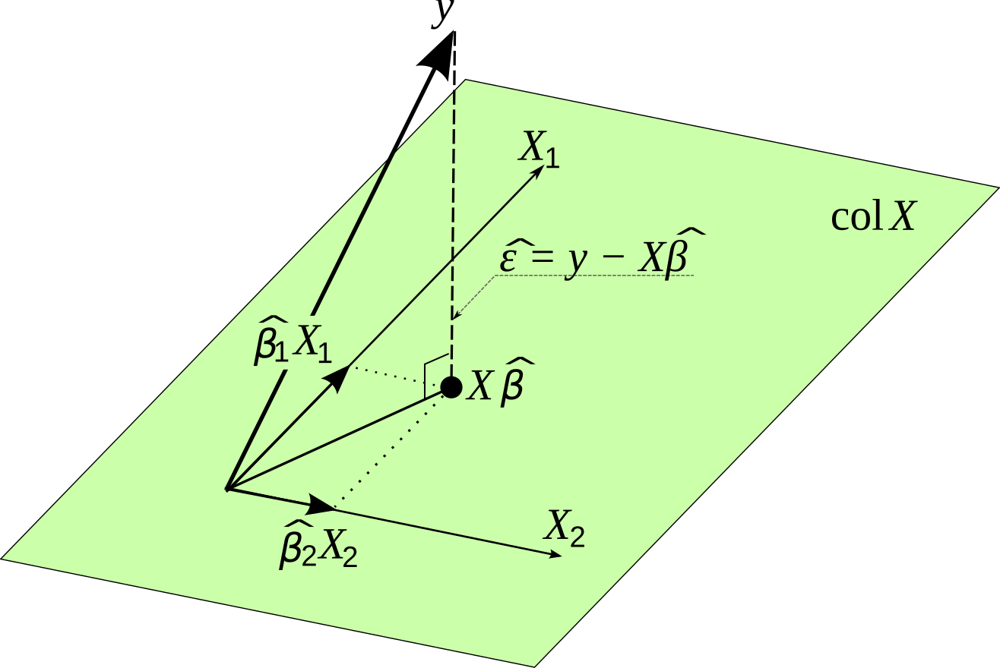

# Module 0: Multiple Linear Regression Review {.unnumbered}

```{r, hide =T, echo=F, message = F}
colorize <- function(x, color) {
  if (knitr::is_latex_output()) {
    sprintf("\textcolor{%s}{%s}", color, x)
  } else if (knitr::is_html_output()) {
    sprintf("<span style='color: %s;'>%s</span>", color,
      x)
  } else x
}

library(dplyr)
library(ggplot2)
```

**Readings**

-   Review matrix algebra [Matrix Cookbook](https://www.math.uwaterloo.ca/~hwolkowi/matrixcookbook.pdf).
-   BIOS 509 notes on Applied Linear Regression.\
-   Gelman & Hill-style regression intuition (figure referenced in class).

**Overview & Concepts:** In this module you will get a brief review of concepts learned in BIOS 509 including the multiple linear regression (MLR) framework for **estimation, interpretation, prediction, and diagnostics**. This material will not be included in the labs or quizzes, but is simply a review guide for you to brush up on material needed for Modules 1-3.

-   Linear regression model in matrix notation

-   Inference for regression coefficient estimates, expected values, and predictions.

-   Dummy variables

-   Effect modification and confounding

------------------------------------------------------------------------

### Motivation and Examples

::: {.callout-important .illustration style="color: red"}
**Multiple Linear Regression (MLR)** is the standard extension of simple linear regression to include two or more predictors.

Formally:

$$
y_i = \beta_0 + \beta_1 x_{i1} + \cdots + \beta_p x_{ip} + \epsilon_i,
\quad \epsilon_i \sim N(0,\sigma^2)
$$

$y_i$ = outcome (continuous response)

$x_{ij}$ = predictor variables (continuous or categorical)

$\beta_j$ = regression coefficients (effects of predictors, holding others constant)

$\epsilon_i$ = error term

**Matrix form**

$$
\mathbf{y} = \mathbf{X}\boldsymbol{\beta} + \boldsymbol{\epsilon}, 
\quad \mathbb{E}[\boldsymbol{\epsilon}] = \mathbf{0}, 
\quad \operatorname{Var}(\boldsymbol{\epsilon}) = \sigma^2 \mathbf{I}
$$

**Key points about MLR:**

-   Goal: quantify how multiple predictors are simultaneously associated with an outcome.

-   Interpretation: each $\beta_j$ is the average change in $y$ for a one-unit change in $x_{j}$, holding other predictors fixed.

-   Uses: adjust for confounding, test effect modification (interactions), improve prediction accuracy.

-   Assumptions: linearity, independence, constant variance (homoscedasticity), and normally distributed errors.

In short: MLR models a continuous outcome as a linear combination of multiple explanatory variables, enabling adjusted and interpretable population-level associations.
:::

**Motivating Example:(NLSY):** maternal traits vs. child cognitive score (age 3).

We want to answer the question: **What maternal traits are associated with a child's cognitive score at age 3?**

Variables:

-   `score`: cognitive test score (outcome)
-   `age`: maternal age at delivery (numeric)
-   `edu`: maternal education --- 1: \<HS, 2: HS, 3: some college, 4: college+

**Model (baseline):**

$$y_i = \beta_0 + \beta_1 \text{age}_i + \epsilon_i$$

**MLR (with confounding):**

$$
y_i = \beta_0 + \beta_1\text{age}_i + \beta_2\mathbb{1}(\text{edu}=2) + \beta_3\mathbb{1}(\text{edu}=3) + \beta_4\mathbb{1}(\text{edu}=4) + \epsilon_i
$$

Below we give some quick visuals

```{r, echo=F, message = F}
# Load and quick EDA
library(readr)
library(gridExtra)
dat <- read_csv("data/testscore.csv", show_col_types = FALSE)
glimpse(dat)


p1 <- ggplot(dat, aes(age, score)) +
  geom_point(alpha=.5) +
  geom_smooth(method="lm", se=FALSE) +
  labs(x="Maternal age at delivery", y="Score")
p2 <- ggplot(dat, aes(factor(edu), score)) +
  geom_boxplot() +
  labs(x="Maternal education (1:<HS ... 4:College+)", y="Score")
gridExtra::grid.arrange(p1, p2)
```

------------------------------------------------------------------------

## [Simple Linear Regression]{.underline}

Linear regression is a method that summarizes how the average values of a numerical outcome variable vary over subpopulations (covariate values) defined by linear functions of predictors. Two goals of linear regression:

1.  *Prediction of outcome values given fixed predictor values.*

2.  *Assessment of impact of predictors on the outcome (Estimation).*

Let $y_i$ denote the test score for a given child $i$. $age_i$ denotes the corresponding maternal age at delivery for mom $i$ corresponding to child $i$, and $\epsilon_i$ denotes the error term. We will consider the following linear model:

$$y_i = \beta_0 + \beta_1 \cdot age_i + \epsilon_i, \quad i = 1,2,3,...,400$$ {#eq-one}

We can write Eq. 1 in matrix form by stacking observations by row:

$$\begin{align}
\mathbf{Y}& = \begin{bmatrix} y_1 \\ y_2\\ \vdots \\ y_n \end{bmatrix} = 
\begin{bmatrix}
\beta_0 + \beta_1 x_1\\ \beta_0 + \beta_1 x_2 \\ \vdots \\ \beta_0 + \beta_1 x_n \end{bmatrix} + \begin{bmatrix} \epsilon_1 \\ \epsilon_2 \\  \vdots \\ \epsilon_n \end{bmatrix}\\
& = \begin{bmatrix} 1 & x_1\\1 & x_2\\ \vdots \\ 1 & x_n\end{bmatrix} \begin{bmatrix}\beta_0 \\ \beta_1\end{bmatrix} + \begin{bmatrix} \epsilon_1 \\ \epsilon_2 \\  \vdots \\ \epsilon_n \end{bmatrix}\\
&= \mathbf{X\beta + \epsilon}
\end{align}$$

Clearly, we cannot find $\mathbf{\beta}$ such that this model fits all of our data perfectly.

**Model Assumptions:**

-   $y_i$ is a linear function of $age_i$, i.e, $E(\mathbf{Y}) = \mathbf{X\beta} = \mathbf{Age\beta}$ is linear in the $\beta's$.

-   $\beta_0=$ the test score for a child born of a mother at age=0 (not meaningful!)

-   $\beta_1=$ average increase in test score associated with one year increase in maternal age.

-   $E(\epsilon_i) = 0$ \[Expectation of the errors is zero\].

------------------------------------------------------------------------

#### [Least Squares Solution]{.underline}

**Our aim is to find estimates of** $\beta_0$ **and** $\beta_1$ **that "best" fit the data, but what does "best" mean?**

We seek $(\hat{\beta}_0, \hat{\beta}_1)$ that minimizes a `r colorize("loss function", "red")`.

Our approach is to minimize the sum of `r colorize("squared differences", "red")` between $\mathbf{Y}$ and $\hat{Y} = \mathbf{X\hat{\beta}}$, i.e., this defines the differences between $\mathbf{Y}$ and the predicted value $\hat{Y}$ based on a fixed set of $\beta's$.

::: {.callout-note .illustration style="color: blue" appearance="minimal" icon="false"}
## Theorem

If $\mathbf{Y} = \mathbf{X\beta} + \mathbf{\epsilon}$ then the value of $\hat{\beta}$ that minimizes $(\mathbf{Y - \hat{Y}})^T(\mathbf{Y - \hat{Y}})$ is $\hat{\beta} = (X'X)^{-1} X'y$.

-   $\mathbf{\hat{Y}} = \mathbf{X \hat{\beta}}$ is the fitted (predicted) value.

-   $\mathbf{\hat{\epsilon}} = \mathbf{Y} - \mathbf{X\hat{\beta}}$ defines the residual error.
:::

::: {.callout-tip collapse="true" style="color:gray" appearance="minimal" icon="false"}
### Derivation (matrix calculus)

We estimate $\hat\beta$ by minimizing the **residual sum of squares** (RSS):

$$
\hat\beta = argmin_{\beta}\; S(\beta),
\qquad
S(\beta)=|\mathbf{y}-\mathbf{X}\beta|_2^2
=(\mathbf{y}-\mathbf{X}\beta)^\top(\mathbf{y}-\mathbf{X}\beta).
$$

**Expand the residual quadratic:** $$
\begin{aligned}
S(\beta)
&= \mathbf{y}^\top\mathbf{y}
 - 2\,\beta^\top\mathbf{X}^\top\mathbf{y}
 + \beta^\top\mathbf{X}^\top\mathbf{X}\,\beta.
\end{aligned}
$$

**Differentiate and set to zero (normal equations):** $$
\nabla_\beta S(\beta)
= -2\,\mathbf{X}^\top\mathbf{y}
 + 2\,\mathbf{X}^\top\mathbf{X}\,\beta
= \mathbf{0}
\quad\Longrightarrow\quad
\mathbf{X}^\top\mathbf{X}\,\hat\beta
= \mathbf{X}^\top\mathbf{y}.
$$

**Solution (full column rank** $\mathbf{X}$: $$
\hat\beta_{OLS}
= (\mathbf{X}^\top\mathbf{X})^{-1}\mathbf{X}^\top\mathbf{y}.
$$ For OLS, we have a nice closed-form solution.

Other loss functions or models often require iterative optimization routines.

**Fitted values & projection:** $$
 \hat{\mathbf{y}}=\mathbf{X}\hat\beta
= \underbrace{\mathbf{X}(\mathbf{X}^\top\mathbf{X})^{-1}\mathbf{X}^\top}_{\mathbf{H}}\mathbf{y},
\quad
\text{with }\mathbf{H}^\top=\mathbf{H},\;\mathbf{H}^2=\mathbf{H},\;\operatorname{tr}(\mathbf{H})=p \text{ (number of predictors)}.
$$

**Orthogonality of residuals: We assume independence between covariate values and residuals.** $$
\mathbf{r}=\mathbf{y}-\hat{\mathbf{y}},\qquad
\mathbf{X}^\top\mathbf{r}=\mathbf{0}.
$$
:::

#### Geometric Interpretation of the OLS estimate

The fitted values $\hat{y}$ are a linear transformation of $y$. We see from the figure $y$ in real space is projected on $\hat{y}$ in model space.

-   The [HAT]{.underline} [matrix]{.underline} is defined as $\mathbf{H} = \mathbf{X(X^{T} X)^{-1}X^T}$. It is a projection matrix that projects $y$ $\rightarrow$ $\hat{y}$.

    $$
    \begin{align}
    \mathbf{\hat{y}} &= \mathbf{X\hat{\beta}}\\
    &= \mathbf{X(X'X)^{-1}X'y}
    \end{align}
    $$

-   The projection matrix is idempotent, i.e., $HH=H$.

-   The trace $=$ rank of $X$ or the number of covariates plus intercept, i.e, $tr(H) = p$.

-   $\hat{\mathbf{Y}}$ and $\mathbf{\hat{\epsilon}}$ are independent, i.e., orthogonal (perpendicular in model space).



------------------------------------------------------------------------

#### [Properties of the OLS Estimator $\hat{\beta}$]{.underline}

1.  If $E(Y) = X\beta$ then $\hat{\beta}$ is unbiased for $\beta$.

$$
\begin{align}
E(\hat{\beta}) & = E[(X^TX)^{-1} X^Ty]\\
& = (X^T X)^{-1} X^T E(y)\\
& =(X^T X)^{-1} X^T X \beta\\
& = \beta
\end{align}
$$

2.  $\hat{\beta}$ is consistent estimation of $\beta$ under very general assumptions, i.e., $lim_{n\rightarrow \infty} P(|\hat{\beta} - \beta|>\epsilon) = 0$.

3.  $\mathbf{\hat{Y}}$ is an unbiased estimator of the mean trend $\mathbf{X\beta}$.

4.  If $cov(y) = \sigma^2 I$, the covariance of the estimator $cov(\mathbf{\hat{\beta}}) = \sigma^2 (X'X)^{-1}$.

**Find the** $\operatorname{Cov}(\hat{\beta})$

We have the linear model $$
\mathbf{y} = \mathbf{X}\beta + \boldsymbol{\epsilon}, 
\qquad \mathbb{E}[\boldsymbol{\epsilon}] = \mathbf{0}, 
\qquad \operatorname{Var}(\boldsymbol{\epsilon}) = \sigma^2 \mathbf{I}.
$$

The OLS estimator is $$
\hat{\beta} = (\mathbf{X}^\top \mathbf{X})^{-1}\mathbf{X}^\top \mathbf{y}
= \beta + (\mathbf{X}^\top \mathbf{X})^{-1}\mathbf{X}^\top \boldsymbol{\epsilon}.
$$

Therefore,

$$
\begin{aligned}
\operatorname{Cov}(\hat{\beta})
&= \operatorname{Var}\!\left[(\mathbf{X}^\top \mathbf{X})^{-1}\mathbf{X}^\top \boldsymbol{\epsilon}\right] \\
&= (\mathbf{X}^\top \mathbf{X})^{-1}\mathbf{X}^\top 
      \underbrace{\operatorname{Var}(\boldsymbol{\epsilon})}_{\sigma^2 \mathbf{I}}
      \mathbf{X}(\mathbf{X}^\top \mathbf{X})^{-1} \\
&= \sigma^2 \, (\mathbf{X}^\top \mathbf{X})^{-1}.
\end{aligned}
$$

::: {.callout-note .illustration style="color: blue" appearance="minimal" icon="false"}
## Gauss-Markov Theorem:

The Gauss-Markov Theorem states that, under the classical linear regression assumptions, the OLS estimator is the **Best Linear Unbiased Estimator (BLUE)** of the coefficients---that is, it has the lowest variance among all linear and unbiased estimators.

-   $\mathbf{Y} = \mathbf{X\beta} +\epsilon$

-   $E(\epsilon) = 0$ and $cov(\epsilon) = \sigma^2 I$

-   $var(\hat{\beta}) = \sigma^2 (X'X)^{-1}$

-   $\hat{\beta}$ is the best (minimum variance) unbiased estimator (BLUE) for $\mathbf{\beta}$.
:::

------------------------------------------------------------------------

## OLS Calculation in R

```{r}


#Calculate beta manually
X = cbind(1, dat$age) #Design Matrix
Y = dat$score #Response/Outcome Vector
beta = solve( t(X) %*% X) %*% t(X) %*% Y
beta

#Visualize the univariate association
plot(score ~ age, data = dat, xlab = "Age", ylab = "Score")
abline(beta, lwd = 3, col = 2)


```

We see that the regression coefficient estimate for age is $0.840$. This means that for every 0.840 unit increase in $age$, there is a 1-unit increase in $child score$.

------------------------------------------------------------------------

## [Statistical Linear Regression & Inference]{.underline}

[The relation between OLS, Normality, and Maximum Likelihood]{style="color:red;"}

So far, we have not discussed the distribution of the errors. For OLS we **did not need** to make any distributional assumption.

$$
\hat{\beta}_{OLS} = (X^TX)^{-1}X^Ty
$$

But for inference (SEs, CIs, p-values), we need to make some distributional assumptions for the errors. Let's now assume...

$$
y_i = \beta_0 + \beta_1 age_i + \epsilon_i, \quad i=1, ..., 400
$$ where $\epsilon \overset{iid}{\sim} N(0, \sigma^2)$.

What does i.i.d mean? [identically and independently distributed.]{.underline} This implies the following model:

-   $y_i$ is normally distributed.

-   This parametrization is equal to

    $$y_i \sim N(\beta_0 + \beta_1 x_i,\sigma^2)$$.

-   where $\beta_0 + \beta_1 x_i$ captures the trend

-   where $\sigma^2$ captures the variability (uncertainty) around the trend. It is constant, i.e., the same across all observations.

-   **In matrix form:** $\mathbf{Y} \sim N(\mathbf{X\beta}, \Sigma)$ where $\Sigma = \sigma^2I$.

-   $\sigma^2$ is unknown!

------------------------------------------------------------------------

#### [The Maximum Likelihood]{.underline}

The likelihood of the normal distribution is given by

$$
L(\beta, \sigma^2, y) = (2\pi \sigma^2)^{-n/2} exp\left(\frac{-1}{2\sigma^2} (Y-X\beta)'(Y-X\beta)\right)
$$

Taking the log of the likelihood, we get:

$$
l(\beta, \sigma^2, y) = \frac{-n}{2} log(2\pi\sigma^2) - \frac{1}{2\sigma^2} (Y-X\beta)'(Y-X\beta)
$$

To find **Maximum Likelihood Estimators** we take partial derivatives and set the equal to zero to find the estimators that maximize the log-likelihood.

What do we get?

-   $\hat{\beta}_{MLE} = (X'X)^{-1}X'y$ so $\hat{\beta}_{MLE} = \hat{\beta}_{OLS}$ [under normality]{.underline}.

-   $\hat{\sigma}^2_{MLE} = \frac{1}{n} (Y-X\hat{\beta})'(Y-X\hat{\beta})$.

-   $E(\hat{\sigma}^2_{MLE}) \neq \sigma^2$ so it is NOT unbiased.

-   An unbiased estimator for $\sigma^2$ is given by $s^2 = \frac{1}{n-p} (Y-X\beta)'(Y-X\beta)$.

|                            | OLS                   | MLE                                                       |
|----------------------------|-----------------------|-----------------------------------------------------------|
| Distributional assumption  | NONE                  | Normal $Y\sim N(X\beta, \sigma^2I)$                       |
| Estimator $\hat{\beta}$    | $(X'X)^{-1}X'y$       | $(X'X)^{-1}X'y$                                           |
| $cov(\hat{\beta})$         | $\sigma^2 (X'X)^{-1}$ | $\sigma^2 (X'X)^{-1}$                                     |
| Estimator $\hat{\sigma}^2$ | Cannot get            | $\frac{1}{n} (Y-X\hat{\beta})'(Y-X\hat{\beta})$ is biased |

: Summary of OLS vs. MLE approaches

------------------------------------------------------------------------

#### [Estimating the Residual Error]{.underline}

We saw above that the MLE estimator of the residual error: $\hat{\sigma}^2 = \frac{1} (Y-X\beta)^T(Y-X\beta)$. But this estimator is biased, i.e., $E(\hat{\sigma}^2) \neq \sigma^2$.

The **unbiased** estimator of the error variance is the **mean squared error (MSE)** of the residuals: $\hat{\sigma}^2 = \frac{1}{n-p} (Y-X\hat{\beta})'(Y-X\hat{\beta})$.

where $p$ is the number of fitted coefficients (including the intercept). Dividing by $n-p$ (the **residual degrees of freedom**) corrects the small-sample bias that would arise if we divided by $n$.

Its square root, $\hat\sigma$, is the **residual standard error**---the typical deviation of observations around the regression line, reported in outcome units.

```{r, message = F}
library(ggplot2)

#Here p = 2
fit = lm(score ~ age, data = dat)
summary(fit)

#Can we confirm this manually
yhat = fit$fitted.values #Predicted Values
y = dat$score #Observed Values
N = length(y)
P=2 #number columns in design matrix
sq_error = (y-yhat)^2 #Squared errors
sigma_squared_est <- sum(sq_error)/(N-P) #Unbiased est of the variance
sigma_est = sqrt(sigma_squared_est) #Unbiased est of the std. error
sigma_est
```

Indeed we see that the estimated residual standard error is $20.3$. But what does this really mean?

We can visualize uncertainty in the regression line (mean). The **pointwise 95% confidence band** for the mean at covariate value $x$ is:

$$
\hat{y}(x)\ \pm\ t_{n-2,\ 0.975}\ \hat{\sigma}\,
\sqrt{\frac{1}{n} + \frac{(x-\bar x)^2}{S_{xx}}}\,,
$$ where

$$
\hat{y}(x)=\hat\beta_0+\hat\beta_1 x,\quad
\bar x=\frac{1}{n}\sum_{i=1}^n x_i,\quad
S_{xx}=\sum_{i=1}^n (x_i-\bar x)^2,\quad
\hat{\sigma}^2=\frac{\sum_{i=1}^n (y_i - \hat y_i)^2}{n-2}.
$$

```{r, message = F}
#Include 95% confidence intervals in your summary

nd  <- data.frame(age = seq(min(dat$age), max(dat$age), length.out = 200))
ci  <- as.data.frame(predict(fit, newdata = nd, interval = "confidence", level = 0.95))
plt <- cbind(nd, ci)

ggplot() +
  geom_point(data = dat, aes(age, score), alpha = 0.6) +
  geom_ribbon(data = plt, aes(x = age, ymin = lwr, ymax = upr), alpha = 0.2) +
  geom_line(data = plt, aes(x = age, y = fit), linewidth = 1.1, color = "darkgreen") +
  labs(x = "Maternal age (years)", y = "Child score",
       title = "OLS fit with 95% CI for the mean response") +
  theme_minimal()

```

**Model Interpretation:** A one year increase in mother's age at delivery was associated with a 0.84 (p-value= 0.027) increase in the child's average test score, where test score was measured at age 3. The association was statistically significant at a type I error rate of 0.05.

There was considerable heterogeneity in test scores $(\hat{\sigma} = 20.34)$. Therefore, the regression model does not predict individual test scores well $(R^2 = 0.012)$. 1.2% of variances is explained by mother's age.

------------------------------------------------------------------------

## [Prediction Interval for a New Observation]{.underline}

Let $\tilde{y}_i$ be a new observation with covariate value $age_i$. How can you obtain its predictive uncertainty? We want to capture the uncertainty in our predicted estimate of the expected value $\hat{y}_i = X\hat{\beta}$ PLUS the uncertainty due to measurement error $\epsilon_i$.

$$
\tilde{y}_i = \hat{\beta}_0 + \hat{\beta}_1 age_i + \epsilon_i, \quad \epsilon_i \sim N(0, \sigma^2)
$$

The total uncertainty surrounding the predicted value $\tilde{y}_i$ can be broken down as the sum of two components.

$$
Var(
\tilde{y}_i) = Var(\hat{\beta}_0 + \hat{\beta}_1 age_i) + Var(\epsilon_i)
$$

-   We know the first term on the right, $Var(\hat{\beta}) = \sigma^2 (X'X)^{-1}$ and so $Var(X\hat{\beta}) = \sigma^2 (x_i^{'} (X'X)^{-1} x_i)$.
-   We know the variance of the error term $Var(\epsilon_i) = \sigma^2$.

We plug in our estimators to get the predicted variance

$$ \tilde{\sigma}^2 = \widehat{\mathrm{Var}}(\tilde{y}_i)
= \hat{\sigma}^2\, x_i^\top (X^\top X)^{-1} x_i + \hat{\sigma}^2,\quad
\tilde{y}_i \pm t_{n-p,0.975}\sqrt{\widehat{\mathrm{Var}}(\tilde{y}_i)}$$

From this derivation we can see that $\tilde{\sigma}^2 \geq \hat{\sigma}^2$. So the 95% prediction interval is going to be wider than the 95% confidence interval.

The approximate 95% prediction interval is given by $\tilde{y}_i \pm 1.96 \tilde{\sigma}$.

```{r}
fit <- lm(score ~ age, data = dat)

# 2) Make a smooth grid over age
nd <- data.frame(age = seq(min(dat$age), max(dat$age), length.out = 200))

# 3) Get intervals
ci <- as.data.frame(predict(fit, newdata = nd, interval = "confidence",  level = 0.95))
pi <- as.data.frame(predict(fit, newdata = nd, interval = "prediction", level = 0.95))

plot_df <- cbind(nd,
                 fit = ci$fit,
                 lwr_ci = ci$lwr, upr_ci = ci$upr,
                 lwr_pi =  pi$lwr, upr_pi =  pi$upr)

# 4) Plot: points, prediction band (wider), mean CI band (narrower), fitted line
ggplot() +
  # prediction band (wider)
  geom_ribbon(data = plot_df,
              aes(x = age, ymin = lwr_pi, ymax =upr_pi), alpha = 0.12, fill = "green") +
  # mean CI band (narrower)
  geom_ribbon(data = plot_df,
              aes(x = age, ymin = lwr_ci, ymax =upr_ci),
              alpha = 0.25) +
  # fitted line
  geom_line(data = plot_df,
            aes(x = age, y = fit),
            linewidth = 1.1) +
  # points last so they sit on top
  geom_point(data = dat,
             aes(x = age, y = score),
             alpha = 0.6) +
  labs(x = "Maternal age (years)", y = "Child score",
       title = "OLS: 95% CI (mean) and 95% PI (individual)") +
  theme_minimal()


```

------------------------------------------------------------------------

## [Model Diagnostics]{.underline}

**Residual vs. Fitted**

-   $\hat{\epsilon}_i$ should be independent of $\hat{y}_i$, i.e., no patterns.

-   Linearity: Red line should be flat, ie banded around 0.

-   Constant variance (homoscedasticity).

**Normal Q-Q Plot**

-   Standardized residual $\hat{\epsilon}_i/ (\hat{ \sigma} \sqrt{1-h_{ii}})$ should be a standard normal.

-   We expect the points to follow a straight line, Check non-normality, particularly skewed tails.

**Scale-Location**

-   Similar to residual vs fitted, but use standardized residual. Diagnose heteroscedasticity (eg red line increasing).

**Residual vs Leverage**

-   Leverage $h_{ii}$ is how far away $x_i$ is from other $x_j$ where $h_{ii} = \frac{\partial \hat{y}_i}{\partial y_i}$.
-   Cook's Distance: measures how much model changes when remove $ith$ point; \>1 is problematic.

```{r}
par(mfrow=c(2,2))
plot(fit)
```

------------------------------------------------------------------------

## [Hypothesis Testing]{.underline}

With the linear regression model established, we now turn to hypothesis testing to determine whether the relationships observed between the independent and dependent variables are statistically significant.

-   (Intercept): $H_0 : \beta_0 = 0$ when $age =0$. In other words test scores are equal to zero for a mother at $age=0$ versus $H_a: \beta_0 \neq 0$.

-   Age: $H_0: \beta_1=0$ In words, the slope of age is equal to zero or there is no linear effect. $H_a: \beta_1 \neq 0$ if there is a significant linear effect.

For a given covariate $\beta_j$, we make the following assumption:

$$
\hat{\beta}_j \sim \mathcal{N}(\beta_j, \mathrm{Var}(\hat{\beta}_j))
$$

The variance of $\hat{\beta}_j$ is:

$$
\mathrm{Var}(\hat{\beta}_j) = \sigma^2 (X^TX)^{-1}_{jj}
$$

Since $\sigma^2$ is unknown, we estimate it using the residual sum of squares:

$$
\hat{\sigma}^2 = \frac{1}{n - p} \sum_{i=1}^{n} \hat{\varepsilon}_i^2 = \frac{1}{n - p} \| y - X\hat{\beta} \|^2
$$

The **standard error** of $\hat{\beta}_j$ is then:

$$
\mathrm{SE}(\hat{\beta}_j) = \sqrt{\hat{\sigma}^2 (X^TX)^{-1}_{jj}}
$$

We test the null hypothesis:

$$
H_0: \beta_j = 0 \quad \text{vs.} \quad H_a: \beta_j \ne 0
$$

The test statistic follows a $t$-distribution under the null hypothesis:

$$
t = \frac{\hat{\beta}_j}{\mathrm{SE}(\hat{\beta}_j)} \sim t_{n - p}
$$

We compare this statistic to critical values of the $t$-distribution or use its corresponding p-value to decide whether to reject $H_0$.

```{r}
summary(fit)
```

------------------------------------------------------------------------

::: {.callout-tip style="color: green"}
## TEST YOUR KNOWLEDGE

1.  Let $H=X(X'X)^{-1}X'$ and let $\hat{Y} = HY$. Then $H\hat{Y} = ?$
2.  Show the derivation for $cov(\hat{\beta})$.
3.  What is the unbiased estimator of $\sigma^2$?
4.  The unbiased estimator for $\sigma^2$ contains a parameter $p$. What does $p$ represent?
5.  Below code is given to simulate data from a "true" model. Run the code to get simulated quantities of covariates $X$ and outcomes $Y$.
6.  What is the "true" intercept in the below simulation?
7.  What is the "true" covariate coefficient value in the below simulation?
8.  Fit the linear model. Find the estimates of the $\beta’s$ and global variance $\sigma^2$.
9.  Interpret the findings of the model in terms of null versus alternative hypotheses.
10. Create diagnostic plots and determine if model assumptions have been met.
:::

```{r, message = F}
#Set seed for reproducibility
set.seed(1232)

#Set the "true" values of the betas.
beta0 = 0.1
beta1 = 0.5
beta2 = -0.2

#Simulated data from two normals
x1 <- rnorm(n=100, 0, 2)
x2 <- rnorm(n=100, 5, 5)
error <- rnorm(n=100, 0, 1)

#Generate the simulated y values
X = cbind(1, x1, x2)
Beta = c(beta0, beta1, beta2)
Y = X %*% Beta + error

###Finish this code to run the proposed model and diagnostics.
```

------------------------------------------------------------------------

## [Confounding]{.underline}

We found that older mothers had children on average with higher test scores. However, higher maternal education was associated with higher age as shown below.

**How do we estimate the age association with outcome accounting for the effect (confounding) of education?**

```{r}
ggplot(dat) +
  geom_boxplot(aes(as.factor(edu),age)) +
  labs(x = "Mother Education", y= "Age at Delivery")

```

###### Confounding

-   Causes spurious correlation.

-   Referred to as "omitted variable bias"

-   We want to [control/account for]{.underline} confounding associations!

-   How do we account for confounding?

**Include confounders in the regression equation** $\rightarrow$ MULTIPLE LINEAR REGRESSION: $y \sim x+z$

-   [Assumptions of linear regression plus omitted variable assumption:]{.underline}

    -   Residuals are independent AND normal.

    -   Global variance (homoscedasticity).

    -   Linearity of all included covariates.

    -   All variables that are not included in the model have coefficient equal to zero (omitted variable bias = 0).

## Adjusting for Confounding:

-   Consider the above model: $y_i = \beta_0 + \beta_1 E_{2i} + \beta_2 E_{3i} + \beta_3 E_{4i} + \beta_4 age_i + \epsilon_i$.

-   Each education group has their own coefficient.

-   The slope of maternal age is constant across education groups (parallel lines).

-   $\beta_4$ is the association between score and age, `r colorize("accounting for different averages in score", "red")` in different education groups.

```{r}

fit = lm(score ~ factor(edu)  + age, data = dat)
summary(fit)

```

-   Age effect is no longer statistically significant after accounting for mother's education level.
-   This model assumes an identical effect of age across ALL education groups.
-   Is this assumption realistic?

------------------------------------------------------------------------

### Categorical Variables

-   First we examine the effects of education on scores.

-   $edu$ is coded as 1,2,3,4. We do NOT want to code this as continuous!!

**Approach 1: an indicator (dummy) for each group.**

$$
X_{1i} = 1_{[edu_i=1]}, X_{2i} = 1_{[edu_2=1]}, X_{3i} = 1_{[edu_i=3]}, X_{4i} = 1_{[edu_i=4]}
$$

If we have $edu_i = [1,1,2,2,3,3,4,4]$, the design matrix is

$$
X\beta = \begin{pmatrix} 
1 & 0 & 0 & 0\\
1 & 0 & 0 & 0\\
0 & 1 & 0 & 0\\ 
0 & 1 & 0 & 0\\
0 & 0 & 1 & 0\\
0 & 0 & 1 & 0\\
0 & 0 & 0 & 1\\
0 & 0 & 0 & 1
\end{pmatrix} \cdot \begin{pmatrix} \beta_1 \\ \beta_2 \\ \beta_3 \\ \beta_4 \end{pmatrix}
$$

-   Note we remove the intercept. If we try to include an intercept, there is linear dependency between columns and there is no unique solution.

```{r}

E1 = as.numeric(dat$edu ==1)
E2 = as.numeric(dat$edu ==2)
E3 = as.numeric(dat$edu ==3)
E4 = as.numeric(dat$edu ==4)

E1[1:6]


fit = lm(dat$score ~ E1 + E2 + E3 + E4  -1) #use -1 to remove the intercept

summary(fit)
```

-   What does each element of $\beta$ vector mean?
    -   $\hat{\beta}_1$ is equivalent to taking the average of scores for kids with mother's $edu=1$. So each $\hat{\beta}$ is equivalent to calculating the mean IQ for each education group.

**Approach 2: Intercept plus three indicators for groups 2,3, and 4.**

$X_{1i} = 1 , X_{2i} = 1_{[edu_2=1]}, X_{3i} = 1_{[edu_i=3]}, X_{4i} = 1_{[edu_i=4]}$

```{r}

fit = lm(dat$score ~ factor(dat$edu))
summary(fit)
```

-   $\hat{\beta}$ represents the difference in average score with respect to the $edu=1$ group., i.e., 10.256 is the average difference between no high school group and high school group.

------------------------------------------------------------------------

## Variance Inflation Factors

-   One must always be on the lookout for issues with multicollinearity!

-   The general issues is that when two variables are highly correlated, it is hard to disentangle their effects.

-   Mathematically, the standard errors are inflated. Suppose we have a design matrix $\mathbf{X} = [x_1, ..., x_p]$ and we want to calculate the variance inflation factor (VIF). We regress $x_1$ against $x_2, ..., x_p$.

-   Let $R_1^2$ be the associated R-squared for $x_1$. Then $VIF_1 = \frac{1}{1-R_1^2}$.

-   It can be shown that $Var(\hat{\beta}_j) = VIF_j \cdot \frac{\sigma^2}{(n-1)s_{x_j}^2}$.

-   Different rules of thumb $VIFs>5$ are cause for concern.

```{r}

library(car)
#Create some correlated data
dat$age2 = dat$age^2 + rnorm(n=400, 0, 10)

fit = lm(dat$score ~ factor(dat$edu) + dat$age + dat$age2)
vif(fit)
# Is this bigger than 5. Age is highly collinear as expected.


#Now try it without age2. Do you see any problems?

```

------------------------------------------------------------------------

## Interaction Effects: Effect Modification

-   We can relax the assumption of identical age effect by including `r colorize("interaction", "red")` terms.
-   Again the reference group is $edu=1$ or $E_{1i}$.

$$
\begin{align*}
y_i &= \beta_0  +\beta_1 E_{2i} + \beta_2 E_{3i} + \beta_3 E_{4i} + \beta_4 age_i + \\
& \beta_5 E_{2i} age_i + \beta_6 E_{3i} age_i + \beta_7 E_{4i} age_i + \epsilon_i
\end{align*}
$$

-   For each edu group: We account for modified effects by examining whether $\beta_5, \beta_6$, and $\beta_7$ are zero.

$$
y_i  = \begin{cases} \beta_0 = \beta_4 age_i &\text{ if edu =1}\\
\beta_0 + \beta_1 + (\beta_4 + \beta_5) age_i& \text{ if edu =2}\\
\beta_0 + \beta_2 + (\beta_4 + \beta_6) age_i &\text{ if edu =3}\\
\beta_0 + \beta_3 + (\beta_4 + \beta_7) age_i &\text{ if edu =4}
\end{cases}
$$

```{r}
library(car)
fit = lm(score ~ factor(edu) * age, data = dat)
summary(fit)
vif(fit)
```

-   `r colorize("Note how the variance is inflated", "red")`

-   This is common with interaction variables since by construction there is dependence between an interaction variable and the main effects.

-   In general, it means we need larger sample sizes to examine interactions.

-   It is `r colorize("important", "red")` to visualize the data and model results.

-   We see the lines are not parallel and the intercept differs across groups.

```{r}
library(ggplot2)
ggplot(dat, aes(age, score)) +
  geom_point() +
  geom_smooth(method = "lm") +
  facet_wrap(~ edu, ncol = 2, scales = "free")

```

------------------------------------------------------------------------

## F-test of interaction

To test whether the interaction was significant, look at whether the inclusion of the interaction significantly "improved" model fit.

-   $H_0$: The interaction between education and age does not improve model fit.
-   $H_A$: The interaction improves model fit.

Suppose we want to choose between these two models, i.e., Full model vs. Reduced model. We use the F-statistic:

::: {.callout-important .illustration style="color: red"}
## F-statistic to perform model comparison

The F statistic is a ratio of two chi-square distributions to test whether the full model gives additional information, e.g., does $\beta_5 = \beta_6 = \beta_7 =0$?

$$
F = \frac{ \text{RSS}_{\text{reduced}} - \text{RSS}_{\text{full}} }{ p_{\text{full}} - p_{\text{reduced}} } \Bigg/ \frac{ \text{RSS}_{\text{full}} }{ n - p_{\text{full}} },.
$$ Another parametrization for the F-test is given by:

$$
F = \frac{y'(H_{full} - H_{reduced})y/p-1}{y'(I-H_{full})y/n-p} = \frac{\chi^2_{p-1-k}/p-1-k}{X^2_{n-p}/n-p} \geq F_{\alpha, k, n-k-1}
$$
:::

```{r}
fit_inter = lm(score ~ factor(edu) * age, data = dat) #Full Model
fit_nointer = lm(score~ factor(edu) + age, data = dat) #Reduced Model
anova(fit_nointer, fit_inter)

```

-   Overall, there is only limited statistical evidence of an interaction!

## `r colorize("Summary", "purple")`

| **Section**                 | **Description**                                                                                                                                                                                                                  |
|-----------------------------|----------------------------------------------------------------------------------------------------------------------------------------------------------------------------------------------------------------------------------|
| **Model (MLR)**             | $\mathbf y=\mathbf X\beta+\boldsymbol\epsilon$, with $E[\boldsymbol\epsilon]=\mathbf 0$, $\operatorname{Var}(\boldsymbol\epsilon)=\sigma^2\mathbf I$. Each $\beta_j$ is an **adjusted** effect.                                  |
| **Estimation (OLS)**        | Minimize RSS $\sum (y_i-\hat y_i)^2$ ⇒ $\hat\beta=(\mathbf X^\top\mathbf X)^{-1}\mathbf X^\top\mathbf y$. Fitted values $\hat{\mathbf y}=\mathbf H\mathbf y$, $\mathbf H=\mathbf X(\mathbf X^\top\mathbf X)^{-1}\mathbf X^\top$. |
| **Key properties**          | $E[\hat\beta]=\beta$; $\operatorname{Cov}(\hat\beta)=\sigma^2(\mathbf X^\top\mathbf X)^{-1}$; residuals are orthogonal to columns of $\mathbf X$.                                                                                |
| **Normality for inference** | For SEs/CIs/p-values assume $\boldsymbol\epsilon\sim\mathcal N(\mathbf 0,\sigma^2\mathbf I)$. **Point estimates don't require normality.**                                                                                       |
| **Residual variance**       | $\hat\sigma^2=\mathrm{SSE}/(n-p)$ with $\mathrm{SSE}=\sum (y_i-\hat y_i)^2$, $p$ includes the intercept. $\hat\sigma$ = residual standard error.                                                                                 |
| **Mean CI & Prediction PI** | 95% **CI** bands quantify uncertainty in the **mean** $\hat y(x)$; 95% **PI** adds error variance and is **wider** (for new observations).                                                                                       |
| **Diagnostics**             | Residuals vs fitted (linearity/variance), Normal Q--Q (normality), Scale--Location (homoscedasticity), Residuals vs leverage/Cook's $D$ (influence).                                                                             |
| **Hypothesis tests**        | $t$-tests for individual coefficients (e.g., slope of age). Partial $F$-tests for blocks of terms (e.g., interactions).                                                                                                          |
| **Confounding**             | Adjust by including confounders in $\mathbf X$ to obtain **population-level, adjusted** associations.                                                                                                                            |
| **Categorical predictors**  | Use $k-1$ indicators with an intercept (reference coding) for group mean differences.                                                                                                                                            |
| **Multicollinearity (VIF)** | $\text{VIF}_j = 1/(1-R_j^2)$; values $\gtrsim 5$ are a concern (rule of thumb in these notes).                                                                                                                                   |
| **Interactions**            | Add terms like $x:\text{group}$ for group-specific slopes; without interactions slopes are common across groups.                                                                                                                 |
| **F-test of interaction**   | Compare **full** vs **reduced** models to test whether interaction terms improve fit.                                                                                                                                            |
