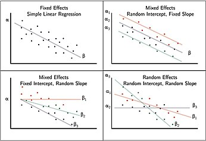
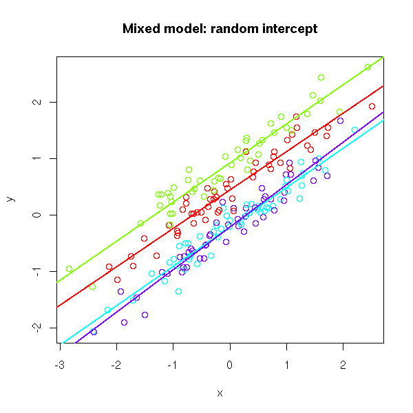

# Module 1A Linear Mixed Models {.unnumbered}

```{r, hide =T, echo=F}
colorize <- function(x, color) {
  if (knitr::is_latex_output()) {
    sprintf("\\textcolor{%s}{%s}", color, x)
  } else if (knitr::is_html_output()) {
    sprintf("<span style='color: %s;'>%s</span>", color,
      x)
  } else x
}
```



```{r, hide =T, echo=F}
colorize <- function(x, color) {
  if (knitr::is_latex_output()) {
    sprintf("\\textcolor{%s}{%s}", color, x)
  } else if (knitr::is_html_output()) {
    sprintf("<span style='color: %s;'>%s</span>", color,
      x)
  } else x
}
```

**Reading**

-   Galecki & Burzykowski (2013). Linear Mixed Effects Models using R.
-   Fox J (2008). Applied Regression Analysis and Generalized Linear Models 2nd ed.
-   Wood, S. *Generalized Additive Models*. Ch 2.
-   <https://m-clark.github.io/mixed-models-with-R/random_intercepts.html>
-   <https://cran.r-project.org/web/packages/lme4/vignettes/lmer.pdf>

### **Overview**

In this module, you'll learn how to model data with hierarchical or correlated structures using **linear mixed models (LMMs).** These models extend standard regression to handle repeated measures or nested data structures, commonly found in longitudinal and multilevel public health data.

**After completing this module, you will be able to:**

-   Identify when LMMs are appropriate

-   Distinguish between fixed and random effects

-   Fit and interpret random intercept and random slope models in R

-   Understand concepts like shrinkage, intraclass correlation, and BLUPs

-   Hierarchical formulation of random effects models

### Motivation and Examples

::: {.callout-important .illustration style="color: red"}
## Motivation:

Correlated data structures arise when multiple observations are taken from the same unit or group: Examples include:

-   **Longitudinal data:** Repeated measures data on each subject
    -   $y_{it}$ denotes the measure at time $t$ for unit $i$.
-   **Clustered or multilevel data:** Observations within nested group structures.
    -   A collection of units from a population of similar units, e.g., $y_{ij}$ denotes measure from person $i$ in demographic group $j$.

Ignoring this structure can lead to biased estimates and invalid inference.
:::

**Motivating Example: The TLC Study:**

The Treatment of Lead-Exposed Children (TLC) was examined using a placebo-controlled randomized study of succimer (a chelating agent) in children with blood lead levels of 20-44 micrograms/dL. These data consist of four repeated measurements of blood lead levels obtained at baseline (or week 0) , week 1, week 4, and week 6 on 100 children who were randomly assigned to chelation treament with succimer or placebo.

| Variable    | Description          |
|-------------|----------------------|
| `id`        | child identifier     |
| `treatment` | succimer or placebo  |
| `week`      | measurement week     |
| `lead`      | lead level (outcome) |

```{r}
tlcdata <- readRDS("data/tlc.RDS")
head(tlcdata)
```

```{r, message = F, warning = F, echo=F}
library(ggplot2)
library(dplyr)
library(gridExtra) 

placebo <- tlcdata %>% 
  filter(treatment == "placebo") %>%
  ggplot() +
  geom_line(aes(x = week, y = lead, col = id)) +
  labs(x = "Week", y="Lead", title = "Placebo") +
  theme(legend.position = "none")

succimer <- tlcdata %>% 
  filter(treatment == "succimer") %>%
  ggplot() +
  geom_line(aes(x = week, y = lead, col = id, linetype = treatment)) +
  labs(x = "Week", y="Lead",title = "Succimer") +
  theme(legend.position = "none")

gridExtra::grid.arrange(placebo, succimer)

```

```{=html}
<!--::: {.callout-tip style="color: green" appearance="minimal" icon="false"}
-   What are some scientific questions we may be interested in studying?
:::-->
```
```{=html}
<!--
{width="600" height="300"}-->
```
### Why Not OLS? [**The wrong approach**]{.underline}

If we ignore clustering and fit the standard linear regression (OLS): 
$$
\begin{align*}
y_{ij}& = \beta_0 + \beta_1 x_{ij} + \epsilon_{ij}\\
\epsilon_{ij} & \overset{iid}{\sim} N(0, \sigma^2)
\end{align*}
$$ we assume that all observations are independent.

But repeated measurements from the same child are **not** independent.

```{r}
fit.lm = lm(lead ~ week, data = tlcdata)
summary(fit.lm)
```

**What assumptions of OLS are we violating?**

-   $\hat{\beta}_1$ is an unbiased and consistent estimator of $\beta_1$.

-   Errors are not independent which leads to incorrect standard error estimates.

-   $\sigma^2$ conflates within and between child variability.

-   Limitations: You cannot forecast individual trajectories.

## [The Better Approach: Introducing Linear Mixed Models]{.underline}

LMMs are extensions of regression in which intercepts and/or slopes are allowed to vary across individual units. They were developed to deal with correlated and/or nested data.

Taking our motivating example, we can assign a separate intercept for each child:

$$
\begin{align*}
y_{ij} &= \beta_{0i} + \beta_1 x_{ij} + \epsilon_{ij}, \\
\epsilon_{ij} & \overset{iid}{\sim} N(0, \sigma^2)
\end{align*}
$$

**Interpretation:**

-   $\beta_{0i}$ is the `r colorize("child-specific", "red")` weight at zero and $\beta_1$ is the constant slope.
-   $\sigma^2$ captures `r colorize("within", "red")` child variability.
-   The mix of random and fixed effects = mixed modeling.

| **Effect Type** | **Definition**             | **Example**                           |
|------------------------|------------------------|------------------------|
| Fixed           | Population-average effects | Effect of week on lead                |
| Random          | Child-specific deviation   | Child-specific intercept $\beta_{0i}$ |
| Random          | Child-week deviation       | Child-week error $\epsilon_{ij}$    |


A limitation to this approach is we are estimating a lot of parameters: Subject specific coefficients don't leverage population information and have less precision because of smaller sample sizes. 

In addition, we cannot forecast the outcome of a `r colorize("new", "red")` child. 

### Random Intercept Model

{width="600"}

Consider the random intercept model with a vector of predictors $x_{ij}$:

$$
\begin{align*}
y_{ij} &=\mu + \theta_i + x_{ij}^T \beta + \epsilon_{ij}\\
\epsilon_{ij} & \overset{iid}{\sim} N(0, \sigma^2)\\
\theta_i & \overset{iid}{\sim} N(0, \tau^2) \\
\theta_i& \perp \epsilon_{ij}
\end{align*}
$$

-   $\mu$ = overall intercept (population mean when $x_{ij}=0$).

-   $\theta_i$ = child specific difference from $\mu$.

-   $\beta_{0i} = \mu + \theta_i$ participant specific intercept or child specific average.

-   $\beta$ = coefficient that does not vary across participants.

-   $\tau^2$ = between group variability.

-   $\sigma^2$ = residual variance or within group variability "measurement error".

**Model Assumptions:**

- We assume the random intercept and random errors are independent $\theta_i \perp \epsilon_{ij}$ for all $i$ and $j$. 

- We assume the random intercepts are normally distributed $\theta_i \sim N(0, \tau^2)$.


### Properties of the Random Intercept Model

*Use the expandable panels below to explore key statistical properties and their derivations.*

::: {.callout-tip collapse="true" style="color:gray" appearance="minimal" icon="false"}
## What is the overall (average) trend?

The population-level mean is computed by taking expectations over both random effects:

$$
\mathbb{E}[y_{ij}] = \mathbb{E}_{\theta_i, \epsilon_{ij}}[(\mu + \theta_i) + \beta x_{ij} + \epsilon_{ij}] = \mu + \beta x_{ij}
$$

**Interpretation**: This is the average regression line across all individuals. The random intercept $\theta_i$ averages to 0.
:::

::: {.callout-tip collapse="true" style="color:gray" appearance="minimal" icon="false"}
## What is the total variability around the overall trend?

Using the law of total variance:

$$
\begin{align*}
\text{Var}(y_{ij}) & = \text{Var}(\mu + \theta_i + \beta x_{ij} + \epsilon_{ij})\\
&  = \text{Var}(\theta_i) + \text{Var}(\epsilon_{ij}) \\
& = \tau^2 + \sigma^2
\end{align*}
$$

**Interpretation**: Total variability includes both between-subject variance ($\tau^2$) and within-subject variance ($\sigma^2$).
:::

::: {.callout-tip collapse="true" style="color:gray" appearance="minimal" icon="false"}
## What is the conditional (group-specific) trend?

Conditioning on $\theta_i$:

$$ 
\mathbb{E}[y_{ij} \mid \theta_i] = (\mu + \theta_i) +  x_{ij}^T \beta
$$

**Interpretation**: Each subject gets their own intercept offset ($\theta_i$), producing a personalized regression line.
:::

::: {.callout-tip collapse="true" style="color:gray" appearance="minimal" icon="false"}
## What is the conditional (within-group) residual variance?

Conditional on $\theta_i$, the only random component is $\epsilon_{ij}$:

$$
\text{Var}(y_{ij} \mid \theta_i) = \text{Var}(\epsilon_{ij}) = \sigma^2 
$$

**Interpretation**: Within each group (or individual), the variance reflects only the measurement error or residual noise.
:::

### Fitting a mixed effects model with a random intercept in R:

```{r, message = F}
library(lmerTest)
fit.randomeffects = lmer(lead ~ week + (1|id), data = tlcdata)
summary(fit.randomeffects)
```

**Model Interpretation:** The fixed effect captures the global or average change in lead level for every one unit change in time, i.e., from week 1 to week 2, $\hat{\beta}_1 = -0.410$, meaning that there is an average 0.4 decrease in lead for every unit increase in week which was found to be statistically significant $p<0.01$.

Now the intercept 22.97 corresponds to the [population-average lead at week 0]{.underline}.

The SE of the slope $se(\hat{\beta_1}) = 0.122$ capturing uncertainty associated with the estimate.

The random effect of child $\beta_{0i}$ allows for child-specific random intercepts, where the variance of the intercepts is 29.63.

### Covariance Structure and Matrix Form

A random intercept model is also known as a `r colorize("two-level", "red")` variance component model:

-   $\theta_i$ is a **random intercept** shared by all observations in group $i$ and has a "intercept-specific" error $\tau^2$.

-   $\epsilon_{ij}$ is the **individual-level residual error**.

--------

#### Derivation: $\text{Cov}(y_{ij}, y_{ik})$ for $j \ne k$

We now derive the **covariance** between two observations from the same person $i$. Let's expand both observations:

$$
\begin{aligned}
y_{ij} &= \mu + \theta_i + \beta x_{ij} + \epsilon_{ij} \\
y_{ik} &= \mu + \theta_i + \beta x_{ik} + \epsilon_{ik}
\end{aligned}
$$

Then,

$$
\text{Cov}(y_{ij}, y_{ik}) = \text{Cov}(\theta_i + \epsilon_{ij},\ \theta_i + \epsilon_{ik})
$$

Using bilinearity of covariance:

$$
= \text{Cov}(\theta_i, \theta_i) + \text{Cov}(\theta_i, \epsilon_{ik}) + \text{Cov}(\epsilon_{ij}, \theta_i) + \text{Cov}(\epsilon_{ij}, \epsilon_{ik})
$$

Now plug in the assumptions:

-   $\text{Var}(\theta_i) = \tau^2$
-   $\text{Cov}(\theta_i, \epsilon_{ij}) = 0$
-   $\text{Cov}(\epsilon_{ij}, \epsilon_{ik}) = 0$ for $j \ne k$

So:

$$
 \text{Cov}(y_{ij}, y_{ik}) = \tau^2\quad  ✅ 
$$ Observations from the same group/cluster share the same random intercept $\theta_i$, which introduces positive correlation.

------------------------------------------------------------------------

#### Derivation: $\text{Var}(y_{ij})$

Let's derive the total (marginal) variability of an individual observation $y_{ij}$ around the population mean, after averaging over the distribution of subjects. By the law of total variance: 

Total variance = between-group variance + within-group variance. 
$$
\text{Var}(y_{ij}) = \text{Var}(\theta_i + \epsilon_{ij}) = \tau^2 + \sigma^2\quad ✅ 
$$
------------------------------------------------------------------------

#### Derivation: $\text{Cov}(y_{ij}, y_{kj})$

The covariance between two different subjects is assumed to be zero: 
$$
\text{Cov}(y_{ij}, y_{kj}) = Cov(\theta_i + \epsilon_{ij}, \theta_k + \epsilon_{kj}) = 0 \quad ✅ 
$$


------------------------------------------------------------------------

#### Covariance Matrix

Suppose we observe two individuals, each measured at three time points:

-   Subject 1: $y_{11}, y_{12}, y_{13}$
-   Subject 2: $y_{21}, y_{22}, y_{23}$

The **marginal covariance matrix** $\text{Cov}(\mathbf{y})$ for the stacked vector:

$$
\mathbf{y} = 
\begin{bmatrix}
y_{11} \\
y_{12} \\
y_{13} \\
y_{21} \\
y_{22} \\
y_{23}
\end{bmatrix}
$$

is:

$$
\text{Cov}(\mathbf{y}) =
\begin{bmatrix}
\tau^2 + \sigma^2 & \tau^2 & \tau^2 & 0 & 0 & 0 \\
\tau^2 & \tau^2 + \sigma^2 & \tau^2 & 0 & 0 & 0 \\
\tau^2 & \tau^2 & \tau^2 + \sigma^2 & 0 & 0 & 0 \\
0 & 0 & 0 & \tau^2 + \sigma^2 & \tau^2 & \tau^2 \\
0 & 0 & 0 & \tau^2 & \tau^2 + \sigma^2 & \tau^2 \\
0 & 0 & 0 & \tau^2 & \tau^2 & \tau^2 + \sigma^2 \\
\end{bmatrix}
$$

-   Within a subject, all pairs of outcomes have covariance $\tau^2$.
-   Between subjects, outcomes are independent (covariance = 0).
-   Diagonal entries reflect total variance: $\tau^2 + \sigma^2$.

This structure is known as **compound symmetry** within each subject (constant pairwise correlation), and **block-diagonal** across subjects.

----------------------------

### Random Intercept Model in Matrix Form

Consider the mixed model with random intercepts for $n$ groups and define $N = \sum_{i=1}^n r_i$.

$$
\mathbf{y} = \mathbf{Z} \mathbf{\theta} + \mathbf{X}\mathbf{\beta} + \mathbf{\epsilon}
$$

where

-   $\mathbf{y} = N \times 1$ vector of response

-   $\mathbf{Z} = N \times n$ design matrix of indicator variables for each group.

-   $\mathbf{\theta} = n \times 1$ vector of random intercepts.

-   $\mathbf{X} = N\times p$ design matrix of fixed effects (including overall intercept).

-   $\mathbf{\beta} = p\times 1$ vector of fixed effects.

-   $\mathbf{\epsilon} = N \times 1$ vector of residual error. 


::: {.callout-note style="color: blue" appearance="minimal" icon="false"}
## Intraclass Correlation

Note that the between group variance is $Cov(y_{ij}, y_{ij'}) = \tau^2$. So the correlation between observations within the same group is: 

$$
\rho = Corr(y_{ij}, y_{ij'}) = \frac{\tau^2}{\tau^2 + \sigma^2} \text{ for all }j \neq j'. 
$$

-   The value $\rho$ is often called the `r colorize("intraclass correlation", "red")`. It measures the degree of similarity among same-group observations `r colorize("compared to the residual error", "blue")` $\sigma^2$.
-   Describes how strongly units in the same group resemble eachother.
-   $\rho \rightarrow 0$ when $\tau^2 \rightarrow 0$ (i.e. same intercept)
-   $\rho \rightarrow 0$ when $\sigma^2 \rightarrow \infty$ (i.e., growing measurement error).
-   $\rho \rightarrow 1$ when $\tau^2 \rightarrow \infty$ (i.e., large separation in intercepts).
-   $\rho \rightarrow 1$ when $\sigma^2 \rightarrow 0$ (i.e., zero measurement error).
-   The above ICC has an exchangeable structure because the correlation is constant between *any pair* of within-group observations.

:::


### Simulation Varying Between Subject Variability

We simulate data for child $i$ in week $j$ using the formula below. We denote simulated quantities using $\tilde{.}$. Note below we vary the degree of between subject variance (heterogeneity) $\tau^2$. 

$$
\begin{align*}
\tilde{y}_{ij} & = 22.976 - 0.4 \times \text{week}_{ij} + \tilde{\theta}_i + \tilde{\epsilon}_{ij}\\
\tilde{\theta}_i & \sim N(0, \tau^2), \quad \tau = (0.5, 16, 100)\\
\tilde{\epsilon}_{ij} & \sim N(0, \sigma^2), \quad \sigma^2 = 4
\end{align*}
$$

```{r, echo=F, message = F}
library(tidyr)
library(gridExtra)
Nobs <- dim(tlcdata)[1]
Nchildren <- length(unique(tlcdata$id))
epsilon_ij <- rnorm(Nobs, mean = 0, sd = 2) #sigma^2 = 4
theta1_i <- data.frame("id" = factor(seq(1:Nchildren)), "theta1.i" = rnorm(Nchildren, 0, sd=0.5))
theta2_i <- data.frame("id" = factor(seq(1:Nchildren)), "theta2.i" = rnorm(Nchildren, 0, sd=16))
theta3_i <- data.frame("id" = factor(seq(1:Nchildren)), "theta3.i" = rnorm(Nchildren, 0, sd=100))

temp_data <- tlcdata %>%
  left_join(theta1_i) %>%
  left_join(theta2_i) %>%
  left_join(theta3_i) %>%
  cbind(epsilon_ij)


intercept = 22.976
beta1 = -0.41

temp_data$y1 = intercept + temp_data$theta1.i + beta1 * temp_data$week  + temp_data$epsilon_ij

temp_data$y2 = intercept + temp_data$theta2.i + beta1 * temp_data$week  + temp_data$epsilon_ij

temp_data$y3 = intercept + temp_data$theta3.i + beta1 * temp_data$week  + temp_data$epsilon_ij


p1=ggplot(temp_data) +
  geom_point(aes(week, y1, group= id), col = "blue") +
  geom_line(aes(week, y1, group=id), col = "blue", alpha = 0.2) + labs(x = "week", y = "lead", title= "Tau = 0.5, ICC = 0.06")

p2=ggplot(temp_data) +
  geom_point(aes(week, y2, group= id), col = "red") +
  geom_line(aes(week, y2, group=id), col = "red", alpha = 0.2) + labs(x = "week", y = "lead", title= "Tau = 16, ICC = 0.98")


p3=ggplot(temp_data) +
  geom_point(aes(week, y3, group= id), col = "green") +
  geom_line(aes(week, y3, group=id), col = "green", alpha = 0.2) + labs(x = "week", y = "lead", title= "Tau = 100, ICC ≈ 1.00")

grid.arrange(p1, p2, p3, nrow=1)

```

### Simulation Varying Sources of Error

We simulate repeated outcomes for child $i$ at week $j$ again under a random–intercept model with a fixed trend over time and three different levels of **within-child** noise $\sigma^2$:

$$
\begin{align*}
\tilde{y}_{ij} & = 22.976 - 0.4 \times \text{week}_{ij} + \tilde{\theta}_i + \tilde{\epsilon}_{ij}\\
\tilde{\theta}_i & \sim N(0, \tau^2), \quad \tau^2 = 16\\
\tilde{\epsilon}_{ij} & \sim N(0, \sigma^2), \quad \sigma^2 = (0.5, 16, 100)
\end{align*}
$$


```{r, echo=F, message=F}
library(tidyr)
library(gridExtra)
Nobs <- dim(tlcdata)[1]
Nchildren <- length(unique(tlcdata$id))

theta_i <- data.frame("id" = factor(seq(1:Nchildren)), "theta.i" = rnorm(Nchildren, 0, sd=sqrt(16)))


epsilon1_ij <- rnorm(Nobs, 0, sd=sqrt(0.5))
epsilon2_ij <- rnorm(Nobs, 0, sd=sqrt(16))
epsilon3_ij <- rnorm(Nobs, 0, sd=sqrt(100))

temp_data <- tlcdata %>%
  left_join(theta_i) %>%
  cbind(epsilon1_ij) %>%
  cbind(epsilon2_ij) %>%
  cbind(epsilon3_ij)


intercept = 22.976
beta1 = -0.41

temp_data$y1 = intercept + temp_data$theta.i + beta1 * temp_data$week  + temp_data$epsilon1_ij

temp_data$y2 = intercept + temp_data$theta.i + beta1 * temp_data$week  + temp_data$epsilon2_ij

temp_data$y3 = intercept + temp_data$theta.i + beta1 * temp_data$week  + temp_data$epsilon3_ij


p1=ggplot(temp_data) +
  geom_point(aes(week, y1, group= id), col = "blue") +
  geom_line(aes(week, y1, group=id), col = "blue", alpha = 0.2) + labs(x = "week", y = "lead", title= "Sig = 0.5, ICC = 0.969")

p2=ggplot(temp_data) +
  geom_point(aes(week, y2, group= id), col = "red") +
  geom_line(aes(week, y2, group=id), col = "red", alpha = 0.2) + labs(x = "week", y = "lead", title= "Sig= 16, ICC = 0.5")


p3=ggplot(temp_data) +
  geom_point(aes(week, y3, group= id), col = "green") +
  geom_line(aes(week, y3, group=id), col = "green", alpha = 0.2) + labs(x = "week", y = "lead", title= "Sig = 100, ICC = 0.138")

grid.arrange(p1, p2, p3, nrow=1)

```

## `r colorize("Summary", "purple")`

| **Section** | **Description** |
|---|---|
| **Motivation** | Repeated/clustered data (e.g., TLC: children measured over weeks) create within-subject correlation that standard OLS ignores. |
| **Why not OLS?** | OLS fit $y_{ij}=\beta_0+\beta_1 x_{ij}+\epsilon_{ij}$ incorrectly assumes independence. Slope can be unbiased, but standard errors are wrong; $\sigma^2$ mixes within/between variability. |
| **Model (random intercept)** | $y_{ij}=\mu+\theta_i+x_{ij}^{\top}\beta+\epsilon_{ij}$, with $\epsilon_{ij}\sim N(0,\sigma^2)$, $\theta_i\sim N(0,\tau^2)$, and $\theta_i\perp \epsilon_{ij}$. $\mu$ = overall intercept; $\theta_i$ = child-specific intercept shift; $\beta$ = fixed-effect slopes. |
| **Mean & variance** | Population mean: $\mathbb{E}[y_{ij}]=\mu+\beta^{\top}x_{ij}$. <br> Conditional mean: $\mathbb{E}[y_{ij}\mid \theta_i]=(\mu+\theta_i)+\beta^{\top}x_{ij}$. <br> Marginal variance: $\operatorname{Var}(y_{ij})=\tau^2+\sigma^2$. <br> Conditional variance: $\operatorname{Var}(y_{ij}\mid \theta_i)=\sigma^2$. |
| **Covariances** | Same subject, different times: $\operatorname{Cov}(y_{ij},y_{ik})=\tau^2$ for $j\neq k$. <br> Different subjects: $\operatorname{Cov}(y_{ij},y_{kj})=0$ for $i\neq k$. <br> Implies compound symmetry within subject and block-diagonal overall covariance. |
| **Matrix form** | $y=Z\theta+X\beta+\epsilon$, where $Z$ maps observations to subject intercepts, $X$ is fixed-effects design. |
| **Intraclass correlation** | $\rho=\dfrac{\tau^2}{\tau^2+\sigma^2}$: proportion of total variance due to between-subject differences; larger $\tau^2$ or smaller $\sigma^2$ $\Rightarrow$ larger within-subject correlation. |
| **Simulation takeaways** | Varying $\tau^2$ (between-subject variance) changes separation between subject-specific lines and increases ICC. <br> Varying $\sigma^2$ (within-subject noise) widens scatter around each subject’s line and reduces ICC. |
| **Fitting & interpretation (R)** | `lmer(lead ~ week + (1|id), data = tlcdata)` fits the random-intercept model. Fixed effect of `week` = average change per week; $\hat\tau^2$ = between-child variance; $\hat\sigma^2$ = within-child variance. |