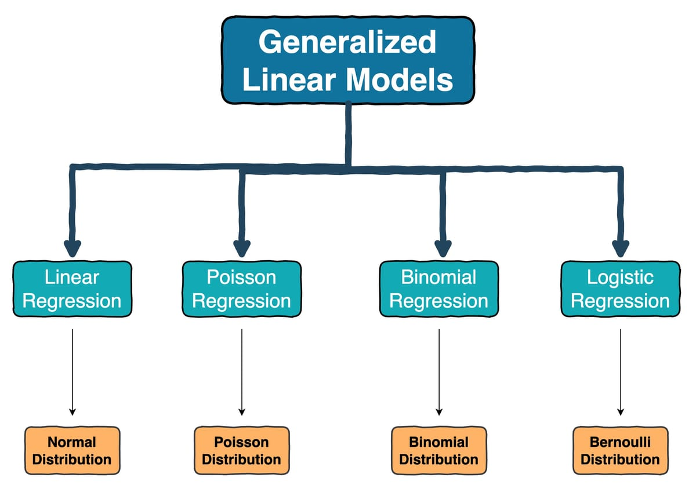

# Module 2B Generalized Linear Models {.unnumbered}

```{r, hide =T, echo=F}
colorize <- function(x, color) {
  if (knitr::is_latex_output()) {
    sprintf("\\textcolor{%s}{%s}", color, x)
  } else if (knitr::is_html_output()) {
    sprintf("<span style='color: %s;'>%s</span>", color,
      x)
  } else x
}
```



## Poisson Regression

The Poisson model is used for count data, that is; where each data point $y_i$ can equal 0,1,2,....N. Poisson models are commonly used for assessing disease and/or mortality counts particularly for rare diseases.

------------------------------------------------------------------------

#### Model Setup

We assume that $y_i$ follows a Poisson distribution: $$
y_i \sim Poisson(\theta_i) = \frac{e^{-\theta_i}\theta_i^{y_i}}{y_i !}
$$

where $\theta_i>0$ is the expected count for observation $i$.

-   An important characteristic of the Poisson distribution is that the mean and variance are equal:

$$
E(y_i ) = Var(y_i) = \theta_i
$$ - This is notable because it is a characteristic that determines whether Poisson is an appropriate model assumption.

-   As with linear and logistic regression, the variation in $y$ can be explained with linear predictors $X$.

$$
\theta_i = exp(X_i \beta)
$$

-   Here the [link]{.underline} is the log() link. log() has domain $(0, \infty)$ and range $(-\infty, \infty)$ and is strictly increasing.

$$
g(\theta_i) = log(\theta_i)
$$ which maps $(0, \infty) \to (-\infty, \infty)$.

------------------------------------------------------------------------

#### Interpretation of Coefficients

-   Consider a simple Poisson regression model with only one covariate:

$$
\begin{align*}
y_i &\overset{ind}{\sim} Pois(\theta_i)\\
log(\theta_i) & = \beta_0 + \beta_1 x_i
\end{align*}
$$

-   The coefficient $\beta_j$ represents the **log change** in the expected count for a one-unit increase in $X_j$ holding other predictors constant.

-   Exponentiating $\beta_j$ gives the **incidence rate ratio (IRR)**:

$$
exp(\beta_j) = \frac{\theta_i^*}{\theta_i}
$$

How did we get that?

**Baseline scenario:** $(X_{ij} = x)$, with expected count $(\theta_i )$.

**One-unit increase in** $(X_{ij})$: $(X_{ij} = x + 1)$, with expected count $(\theta_i^{*} )$.

The difference in log-mean is:

$$
\log \theta_i^{*} - \log \theta_i = \beta_j.
$$ Exponentiating both sides, we have:

$$
e^{\beta_j} = \frac{\theta_i^{*}}{\theta_i},
$$

which is interpreted as the **incidence rate ratio (IRR)** --- the multiplicative change in the expected count for a one-unit increase in $( X_{ij} )$, holding other variables constant.

------------------------------------------------------------------------

#### Fitting a Poisson Regression in R

We are going to use the preterm birth data from Georgia to illustrate our approach. For this analysis, the data have been aggregated by 5-year maternal age groups and stratified by infant sex and maternal tobacco use. This aggregation allows us to model counts of preterm births (events) relative to the number of total live births (exposure) using a Poisson regression.

```{r, warning = F, message = F}

library(lme4)
library(lmerTest)
library(dplyr)

load("/Users/emilypeterson/Library/CloudStorage/OneDrive-EmoryUniversity/BIOS 526/BIOS526_Book/data/PTB.Rdata")


dat$age_group <- cut(dat$age,
                     breaks = seq(15, 45, 5),
                     right = FALSE,
                     labels = c("15-19", "20-24", "25-29", "30-34", "35-39", "40-44"))

agg_data <- dat %>%
  group_by(age_group, male, tobacco) %>%
  summarise(
    events = sum(ptb),
    total = n()
  )

head(agg_data)

```

Here we can see the **number of preterm births (`events`) for each age-group--sex--tobacco combination**, as well as the **total number of live births (`total`)** in that subgroup.

To fit a Poisson regression, we model the counts of events with a **log link function**, using the total number of births as an **offset**:

```{r, warning = F, message = F}

fit_poisson <- glm(events ~ age_group + male + tobacco,
                   family = poisson,
                   offset = log(total),
                   data = agg_data)

summary(fit_poisson)

```

**Model Interpretation:**

-   The intercept ($\hat{\beta}_0 = -2.37$) represents the log rate of preterm birth for the reference group: mothers aged 15--19, with female infants and no tobacco use. Converting to a rate: $e^{-2.37} \approx 0.093$, meaning about 9 preterm births per 100 live births in this reference group.

-   Age effects: Compared to mothers aged 15--19: Ages 20--24 have a 11% lower rate of preterm birth: $e^{-0.119} \approx 0.89$ (p = 0.008). Ages 25--29 have a 22% lower rate: $e^{-0.247} \approx 0.78$ (p \< 0.001). Ages 30--34 have a 20% lower rate: $e^{-0.219} \approx 0.80$ (p \< 0.001). No significant difference is observed for ages 35--39 or 40--44 (p \> 0.05).

-   Infant sex: Male infants have a 6.9% higher preterm birth rate compared to female infants: $e^{0.066} \approx 1.07$ (p = 0.007).

-   Tobacco use: Mothers who smoke have a 42% higher preterm birth rate compared to non-smokers: $e^{0.349} \approx 1.42$ (p \< 0.001).

-   Goodness-of-fit: The residual deviance (29.89 on 16 df) suggests an adequate fit, and the model explains a substantial portion of variation compared to the null model (null deviance = 148.53).

------------------------------------------------------------------------

#### What is an Offset?

In the code above you saw a parameter in the glm $\text{offset = log(total)}$. This is called an offset in Poisson regression.

When modeling **rates** rather than raw counts, it is critical to account for the **population-at-risk** or the **exposure time** for each observation. In the context of preterm birth data, the **total number of live births** within each age--sex--tobacco subgroup serves as the population-at-risk. Without this adjustment, groups with larger populations would naturally have higher counts simply due to their size, not because they have a higher risk of preterm births.

**Why Use an Offset?**

-   The Poisson regression models the expected **count** of events $y_i$ as: $$
    y_i \sim \text{Poisson}(\theta_i)
    $$ where $\theta_i$ is the **expected count** for the $i$th subgroup.

-   To model **rates**, we can express: $$
    \text{Rate}_i = \frac{\theta_i}{N_i}
    $$ where $N_i$ is the **population size** (e.g., total births in the subgroup).

-   Taking logs: $$
    \log(\theta_i) = \log(N_i) + \log(\text{Rate}_i).
    $$ Here, $\log(N_i)$ is treated as a **known constant** rather than a parameter to estimate.

-   This motivates the use of an **offset term**: $$
    \log(\theta_i) = \log(N_i) + X_i \beta,
    $$.

------------------------------------------------------------------------

### Poisson Overdispersion

One of the most important assumptions of the Poisson model is **equidispersion**, meaning the variance of the outcome equals the mean:

$$
E(y_i) = Var(y_i) = \theta_i.
$$

In real data, especially with health outcomes, this assumption often fails. **Overdispersion** occurs when the variance is larger than the mean:

$$
Var(y_i) > E(y_i).
$$

This can lead to: - Standard errors that are too small\
- Confidence intervals that are too narrow\
- p-values that are too optimistic

------------------------------------------------------------------------

#### How to Check for Overdispersion

A common diagnostic is the **dispersion statistic**, defined as:

$$
\hat{\phi} = \frac{\text{Residual Deviance}}{\text{Residual Degrees of Freedom}}
$$

-   If $\hat{\phi} \approx 1$, the equidispersion assumption holds.\
-   If $\hat{\phi} > 1.5$, the data are likely overdispersed.\
-   If $\hat{\phi} < 1$, underdispersion may be present (less common).

In R:

```{r}
# Calculate dispersion statistic
deviance(fit_poisson) / df.residual(fit_poisson)
```

------------------------------------------------------------------------

#### Remedies for Overdispersion

**Quasi-Poisson Model:**

The quasi-Poisson approach allows the variance to be proportional to the mean but inflated by a dispersion parameter:

$$
Var(y_i) = \phi \cdot \theta_i
$$

-   Implemented in R with `family = quasipoisson`.\
-   Coefficient estimates remain the same as Poisson, but **standard errors are corrected**.

```{r}
fit_quasi <- glm(events ~ age_group + male + tobacco,
                 family = quasipoisson,
                 offset = log(total),
                 data = agg_data)
summary(fit_quasi)

```

------------------------------------------------------------------------

#### Differences between the Binomial and Poisson models

The Poisson model is similar to the binomial model for count data but is applied in slightly different situations.

-   If each data point $y_i$ can be interpreted as the number of "successes" out of $n_i$ trials then it is standard to use the binomial/logistic model.

-   If each data point $y_i$ does not have a natural limit- it is not based on a number of independent trials- then it is standard to use the Poisson/log repression model.

------------------------------------------------------------------------

## `r colorize("Summary", "purple")`

| **Section**            | **Description**                                                                                                                                                                                                                          |
|------------------------|------------------------------------------------------------------------------------------------------------------------------------------------------------------------------------------------------------------------------------------|
| **What is the model?** | **Poisson Regression:** Models count data ($y_i = 0,1,2,...$) assuming $y_i \sim \text{Poisson}(\theta_i)$, where $E(y_i) = \theta_i$ and $Var(y_i) = \theta_i$. The mean count is linked to predictors by $\log(\theta_i) = X_i \beta$. |
| **Link Function**      | Uses the **log link**, $g(\theta_i) = \log(\theta_i)$, mapping $(0, \infty) \rightarrow (-\infty, \infty)$. Coefficients represent changes in the log of the expected count.                                                             |
| **Interpretation**     | $e^{\beta_j}$ is the **incidence rate ratio (IRR)**: the multiplicative change in the expected count for a one-unit increase in $X_j$, holding other variables constant.                                                                 |
| **Offsets**            | Adjusts for **population-at-risk** or exposure time. The model becomes $\log(\theta_i) = \log(N_i) + X_i \beta$, where $\log(N_i)$ is an offset term (not estimated).                                                                    |
| **Model Assumptions**  | \- Counts are independent. <br> - Mean equals variance (no overdispersion). <br> - Correct link function (log).                                                                                                                          |
| **Overdispersion**     | Check using **dispersion statistic** ($\hat{\phi} = \tfrac{\text{Residual Deviance}}{\text{df}}$). <br> If $\hat{\phi} > 1$, use: <br> - **Quasi-Poisson** (adjusts SEs). <br> - **Negative Binomial** (flexible variance).              |
| **Key Differences**    | \- Use **Binomial/Logistic** regression when counts are bounded by a number of trials ($n_i$). <br> - Use **Poisson** regression when counts have no natural upper limit and represent rates or events over a fixed exposure.            |
| **Example Findings**   | Tobacco use increases preterm birth rate by **42%** ($IRR \approx 1.42$), while mothers aged 25--29 have a **22% lower** rate ($IRR \approx 0.78$) compared to ages 15--19.                                                              |
