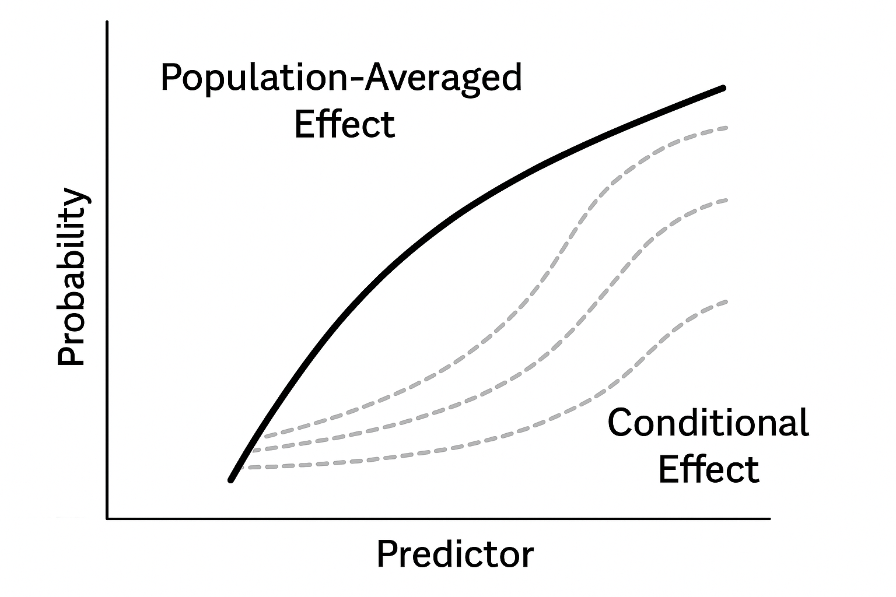

# Module 2C Generalized Linear Mixed Models {.unnumbered}

```{r, hide =T, echo=F, message = F}
colorize <- function(x, color) {
  if (knitr::is_latex_output()) {
    sprintf("\\textcolor{%s}{%s}", color, x)
  } else if (knitr::is_html_output()) {
    sprintf("<span style='color: %s;'>%s</span>", color,
      x)
  } else x
}
```

### Motivation and Examples

::: {.callout-important .illustration style="color: red"}
## Motivation:

In many real-world datasets, observations are **non-normal** and **not independent**. For example:

-   Repeated measurements on the same subject.
-   Clusters of data within counties, hospitals, or schools.
-   Panel data where observations are grouped by time or region.

**Why can't we use standard GLMs?**

-   A standard GLM assumes independent observations. When data are clustered, this assumption is violated, leading to **biased standard errors** and **incorrect inference**.

-   To address this, **Generalized Linear Mixed Models (GLMMs)** extend GLMs by including **random effects** that account for within-group correlation and unobserved heterogeneity.

-   Essentially we are combining methods learned in Modules 1 and 2.
:::

### Motivating Example: Crossover Design

We consider a crossover trial on cerebrovascular deficiency:

Data were obtained from a crossover trial on the disease of cerebrovascular deficiency. The goal is to investigate the side effects of a treatment drug compared to a placebo

Design:

-   34 patients: an active drug (A) and followed by placebo (B).

-   33 patients: a placebo (B) followed by an active drug (A).

-   Outcome: a normal (0) or abnormal (1) electrodiagram.

-   Each patient has a binary observation at period 1 and period 2.

-   Crossover design: can have "carryover" effects which confound treatment effect estimation. Test whether washout period was adequate.

Variables:

-   ID $i$: subject id

-   period $j$: 0 = period 1, 1 = period 2.

-   group: 0 = B then A, 1 = A then B

-   outcome $y_{ij}$: 0 = normal ECG response; 1 = abnormal ECG response.

-   trt: 0 = placebo, 1 = active drug.

```{r}

data <- readRDS(paste0("data/crossover.RDS"))

head(data)

```

Consider the following logistic model assuming responses within each subject are independent.

-   Model 1: $logit P(y_{ij} =1) = \beta_0 + \beta_1 trt_{ij}$

-   Model 2: $logit P(y_{ij} = 1) = \beta_0 + \beta_1 trt_{ij} + \beta_2 period_{ij}$

-   Model 3: $logit P(y_{ij} = 1) = \beta_0 + \beta_1 trt_{ij} + \beta_2 period_{ij} + \beta_3 trt_{ij} \times period_{ij}$

::: {.callout-tip collapse="true" style="color:gray" appearance="minimal" icon="false"}
## What is the interpretation of $\beta_1$?

The parameter $\beta_1$ represents the log-odds difference in the probability of having an abnormal ECG response between the active drug (trt = 1) and placebo (trt = 0), holding other variables (such as period) constant.

-   $\exp(\beta_1)$ is the odds ratio of an abnormal ECG response for patients on the active drug compared to those on placebo.
-   If $\beta_1 > 0$, the active drug is associated with higher odds of abnormal ECG.
-   If $\beta_1 < 0$, the active drug is associated with lower odds of abnormal ECG.
:::

::: {.callout-tip collapse="true" style="color:gray" appearance="minimal" icon="false"}
## What is the interpretation of $\beta_2$?

The parameter $\beta_2$ captures the effect of the study period on the log-odds of an abnormal ECG response, independent of treatment. Specifically, $\beta_2$ represents the change in log-odds of an abnormal ECG when moving from period 1 (period = 0) to period 2 (period = 1), holding treatment (trt) constant.

-   $\exp(\beta_2)$ is the odds ratio of an abnormal ECG in period 2 compared to period 1, after adjusting for treatment.
-   A significant $\beta_2$ may indicate period effects (e.g., differences due to time, learning effects, or insufficient washout).
:::

::: {.callout-tip collapse="true" style="color:gray" appearance="minimal" icon="false"}
## What is the interpretation of $\beta_3$?

The parameter $\beta_3$ represents the interaction between treatment and period. It measures how the treatment effect (the difference in log-odds between active drug and placebo) changes from period 1 to period 2.

-   If $\beta_3 = 0$, it means the treatment effect is consistent across periods.
-   If $\beta_3 \neq 0$, it suggests the treatment effect differs between the two periods, which could indicate a carryover effect (e.g., residual impact of the drug from the previous period).
-   $\exp(\beta_3)$ quantifies how the odds ratio for treatment vs. placebo changes in period 2 relative to period 1.
:::

```{r, warning = F, message = F}

fit_model1 <- glm(formula = outcome ~ 1+ trt ,

    family = binomial(link = "logit"),

    data = data)

fit_model2 <- glm(formula = outcome ~ 1+ trt + period ,

    family = binomial(link = "logit"),

    data = data)

fit_model3 <- glm(formula = outcome ~ 1+ trt + period + trt*period,

    family = binomial(link = "logit"),

    data = data)

# summary(fit_model1)
# 
# summary(fit_model2)
# 
# summary(fit_model3)

```

| Covariate                     | Model 1      | Model 2      | Model 3      |
|-------------------------------|--------------|--------------|--------------|
| Intercept $\beta_0$           | -1.08 (0.28) | -1.22 (0.34) | -1.54 (0.45) |
| Treatment $\beta_1$           | 0.56 (0.38)  | 0.56 (0.38)  | 1.11 (0.57)  |
| Period $\beta_2$              |              | 0.27 (0.38)  | 0.85 (0.58)  |
| Trt $\times$ Period $\beta_3$ |              |              | -1.02 (0.77) |

-   We compared models to check for period $\beta_2$ and carryover $\beta_3$ effects.
-   Ignoring period effects (Model 1) biases treatment effect $\beta_1$.
-   Model 3: after controlling for period and carryover effects, the estimated OR of abnormal ECG in period 1 was $3.03 = e^{1.11}$ and p-value = 0.053. The 95% confidence interval is

$$
(e^{1.11-1.96 * 0.57}, e^{1.11 + 1.96 * 0.57}) = (0.99, 9.27)
$$

-   At $\alpha = 0.05$, we fail to reject the null hypothesis that the treatment in period has an impact on the probability of an abnormal ECG. However, future research is needed since the p-value is 0.053.

-   $\beta_3$ is negative - the second period effect is smaller for those who received active drug during the second period; however, not significant. This confirms no strong carryover effect.

------------------------------------------------------------------------

### Calculating Predicted Probabilities

Using the estimates from Model 3, we can calculate predicted probabilities for each treatment/period combination:

Treatment → Placebo group:

$$
\begin{align*}
P(outcome = 1|period=0, trt=1) &= \left(\frac{e^{\beta_0 + \beta_1}}{1 + e^{\beta_0 + \beta_1}}\right) = 0.394\\
P(outcome = 1|period=1, trt=0) &= \left(\frac{e^{\beta_0 + \beta_2}}{1 + e^{\beta_0 + \beta_2}}\right) = 0.333
\end{align*}
$$

Placebo → Treatment group:

$$
\begin{align*}
P(outcome = 1|period=0, trt=0) &= \left(\frac{e^{\beta_0 }}{1 + e^{\beta_0 }}\right) = 0.176\\
P(outcome = 1|period=1, trt=1) &= \left(\frac{e^{\beta_0 + \beta_1 + \beta_2 + \beta_3}}{1 + e^{\beta_0 + \beta_1 + \beta_2 + \beta_3}}\right) = 0.353
\end{align*}
$$

------------------------------------------------------------------------

#### Model Comparisons

This is review from Module 2. We can compare models using the LRT and AIC metrics. Here we want to compare the three nested models

-   **Nested Models:**\
    Models are nested when the simpler model (reduced) can be obtained by setting one or more parameters of the larger model (full) to zero.\
    *Example:* Model 1 (treatment only) ⊂ Model 2 (treatment + period) ⊂ Model 3 (treatment + period + interaction).

-   **Likelihood Ratio Test (LRT):**

    -   Test statistic:\
        $$
        \lambda_{LR} = -2 \big[ l(\hat{\beta}_{reduced}) - l(\hat{\beta}_{full}) \big].
        $$
    -   Under $H_0$, $\lambda_{LR} \sim \chi^2_{df}$, where $df = p_{full} - p_{reduced}$.\
    -   In R: In this example, we will compare model fits 1 and 2.

```{r}
fit_reduced <- fit_model1
fit_full <- fit_model2
anova(fit_reduced, fit_full, test = "LRT")
```

-   A significant LRT p-value means the additional variable(s) improve model fit. In our results, we show there is not a significant difference between models 1 and 2.

-   **Information Criteria (AIC/BIC):**

    -   **AIC:**

$$
    AIC = -2 \, l(\hat{\beta}) + 2p,
$$ where $p$ is the number of parameters. Lower AIC indicates better fit.\
- Use AIC/BIC penalizes models with larger number of parameters by $2p$, so it tests whether added complexity is warranted.

```{r}
AIC(fit_model1)
AIC(fit_model2)
AIC(fit_model3)
```

-   A difference of **2+ in AIC** is often considered meaningful.\
-   The lowest AIC comes from model 1 (but it is only slightly lower) meaning the three models perform similarly. There is really nothing gained in models 2 and 3.

**What's wrong with this model???**

-   It assumes observations are independent, but they are not.

    $L(\beta; y,x) = \prod_{i=1}^n \prod_{j=1}^{r_i} p_{ij}^{y_{ij}} (1-p_{ij})^{1-y_{ij}}$

-   The product of the individual likelihoods implies the independence assumption, i.e., the product treats clustered observations in the same way as different participants.

------------------------------------------------------------------------

## **The Better Approach: Generalized Linear Mixed Model**

A **Generalized Linear Mixed Model (GLMM)** is an extension of GLM that allows for both **fixed** and **random** effects. It is used when data are not normal and are not independent. Main components of GLMMs:

1.  A **GLM structure**: Response variable $y_{ij}$ from the exponential family with link function $g(\cdot)$.
2.  **Random effects**: Group-specific terms (e.g., intercepts or slopes) to capture within-group variability. Account for correlation or heterogenity within groups.
3.  **Fixed effects**: Population level parameters that apply to all observations.

For clustered data with groups $i = 1, \dots, n$ and observations $j = 1, \dots, r_i$:

$$
\begin{align*}
y_{ij} &\sim \text{Distribution}(p_{ij}) \\
g(p_{ij})&= \beta_0 + x_{ij}' \beta + \theta_i
\end{align*}
$$

where:

-   $g()$ is the link function that connects the mean of the response variable to the linear predictor.
-   $\beta_0$ is the **overall intercept** (fixed effect).
-   $x_{ij}$ is a vector of covariates.
-   $\beta$ is the vector of **fixed effects** (population-level effects).
-   $\theta_i \sim N(0, \tau^2)$ is a **random intercept** for group $i$.
-   $\tau^2$ captures between-group variance.

<!-- Let index $i=1,…,n$ denote group ID, $j=1,…,r_i$ denote observation within group $i$, $N=\sum_{i=1}^n r_i$. Consider the random-intercept logistic regression model: -->

<!-- \$\$ -->

<!-- \begin{align*} -->

<!-- y_{ij} &\sim Binomial (p_{ij})\\ -->

<!-- logit(p_{ij}) & = \beta_0 + \theta_i + x_{ij}' \beta\\ -->

<!-- \theta_i &\sim N(0, \tau^2) -->

<!-- \end{align*} -->

<!-- \$\$ -->

<!-- -   $\beta_0$ is the overall baseline log odds. -->

<!-- -   $\theta_i$ is the difference between group-specific baseline log odds and $\beta_0$, i.e., Group-specific total intercept = $\beta_0 + \theta_i$. -->

<!-- -   $x_{ij}$ is the $p \times 1$ vector of covariates and $\beta$ is the corresponding vector of regression coefficients. -->

<!-- -   $\tau^2$ is the variation of baseline log odds between groups (e.g. each group is an individual). -->

<!-- -   We assume the group-specific intercept is normally i.i.d distributed. -->

### Likelihood in GLMM Estimation

Let $\mathbf{y}$ be all the data and $\mathbf{\theta}$ the vector of all random effects. So there are **two** levels of randomness. We can define the joint distribution $[\mathbf{y}, \mathbf{\theta}]$:

$$
\begin{align*}
[\mathbf{y}, \mathbf{\theta}] &= \prod_{i=1}^{n} [\mathbf{y}_i, \theta_i] \qquad \mathbf{y}_i \text{ are independent}\\
&= \prod_{i=1}^n [\mathbf{y}_i|\theta_i][\theta_i], \quad \text{Chain Rule}\\
&= \prod_{i=1}^n \left(\prod_{j=1}^{r_i} [y_{ij}|\theta_i]\right)[\theta_i] \qquad (\bf{\text{condition independence assumption}})\\
&= \prod_{i=1}^n \left(\prod_{j=1}^{r_i} [y_{ij} |\theta_i]\right) (2\pi \tau^2)^{-1/2} exp\left(-\frac{\theta_i^2}{2\tau^2}\right)
\end{align*}
$$

where $n=$ total number of subjects (groups) and $r_i$ number of observations within each subject/group.

The $y_{ij}$ are [conditionally independent given the random effects]{.underline}. This is a critical assumption that clusters are independent from each other if we fix random effects.

We define the likelihood for the [fixed parameters]{.underline}. Integrating each $\theta_i$, the likelihood is:

$$
L(\beta,\beta_0,\tau^2|\mathbf{y}) = \prod_{i=1}^n \int\left(\prod_{j=1}^{r_i} [y_{ij} |\theta_i]\right) (2\pi \tau^2)^{-1/2} exp\left(-\frac{\theta_i^2}{2\tau^2}\right)
$$

-   $n$ integrals is hard to solve.

### Find the MLE

-   Because of our non-linear link function, maximizing the above function that involves an integral is quite challenging.

-   Statistical software performs numerical integration that involves some approximation. Convergence issues are commong in glmms.

------------------------------------------------------------------------

### Fitting GLMMs

To handle correlated observations, we include a **subject-specific random intercept** $\theta_i$:

$$
logit P(y_{ij}=1) = \beta_0 + \beta_1 \text{trt}_{ij} + \beta_2 \text{period}_{ij} + \beta_3 (\text{trt} \times \text{period})_{ij} + \theta_i,
$$

where $\theta_i \sim N(0, \tau^2)$.

-   $\theta_i$ represents **subject-specific deviations** from the population-level log-odds $\beta_0$.
-   This structure correctly models the **within-subject correlation**.

The random intercept logistic model can be fit using the $glmer()$ function with the binomial family.

```{r}

library(lme4)

fit_glmm <- glmer(formula = outcome ~ trt*period + (1|ID) ,

    family = binomial(link = "logit"),

    data = data, nAGQ = 100)

summary(fit_glmm)

```

**Interpretation:**

| Covariate                     | GLM          | GLMM         |
|-------------------------------|--------------|--------------|
| Intercept $\beta_0$           | -1.54 (0.45) | -4.98 (2.12) |
| Treatment $\beta_1$           | 1.11 (0.57)  | 3.58 (2.11)  |
| Period $\beta_2$              | 0.85 (0.58)  | 2.78 (2.02)  |
| Trt $\times$ Period $\beta_3$ | -1.02 (0.77) | -3.32 (3.27) |
| $\tau^2$                      | ---          | $24.15$      |

-   The point estimates from the random intercept model (GLMM) are **larger**, but their **standard errors also increased**, so inference on direction and significance remains the same.

-   The baseline (period 1, placebo) **log-odds** across subjects has:

    -   A population mean of $-4.98$,
    -   A standard deviation of $4.92$.

-   The middle 95% of subjects have baseline log-odds between: $$
    -4.98 \pm 1.96 \times 4.92 = (-14.62, \, 4.66),
    $$ which corresponds to baseline probabilities of approximately $(4 \times 10^{-7}, \, 0.99)$ --- indicating **very large between-subject heterogeneity**!

------------------------------------------------------------------------

### Population versus Conditional Interpretations



In a **GLM**, we estimate the **marginal model**, where random effects are integrated out or assumed zero:

$$ 
g(E[y_{ij}]) = \beta X_{ij},
$$ which is interpreted as the `r colorize("population-averaged effect", "red")` or `r colorize("marginal effect", "blue")`. In contrast, a **GLMM** estimates the slopes **conditional on random effects**:

$$
g(E[y_{ij}|\theta_i]) = \beta X_{ij} + \theta_i,                                       $$

where $\theta_i$ accounts for subject-specific deviations. These are known as `r colorize("conditional effects", "blue")`. Because GLMs assume independence, they can underestimate standard errors when clustering is ignored.

To clarify the difference, consider the **subject-specific (conditional)** expectation and the **population-averaged (marginal)** expectation. For a given subject $i$, the expected outcome at observation $j$ is

$$
E(y_{ij} \mid \theta_i) = g^{-1} \big( \beta_0 + \theta_i + \sum_{k=1}^p \beta x_{ijk} \big),                                                                                 $$

where $g^{-1}$ is the inverse link function, $\beta_0 + \theta_i$ represents the subject-specific intercept, and the $\beta x_{ijk}$ terms are fixed effects. This expression defines an individual trajectory, capturing how each subject deviates from the population mean.

The **population-averaged mean** is obtained by integrating over the distribution of random effects:

$$ 
E[y_{ij}] = E_{\theta_i} \left[ g^{-1} \big( \beta_0 + \theta_i + \beta'X_{ij} \big) \right].
$$

For non-linear link functions such as the logit, this is not equal to simply applying $g^{-1}$ to the fixed-effect part:

$$
E[g^{-1}(z)] \neq g^{-1}(E[z]).                                                         $$

This explains why the population-averaged curve (the black line in the figure) does not match the mean of the subject-specific curves. The non-linearity of $g^{-1}$ causes averaging across individual probabilities to produce a curve with a different shape. Thus, GLMs and GLMMs provide fundamentally different interpretations of the coefficients $\beta$.

------------------------------------------------------------------------

## Poisson Regression

The **Poisson model** is used for **count data**, where each observation $y_i$ can take non-negative integer values $0, 1, 2, \dots$:

$$
y_i \sim \text{Poisson}(\theta_i) = \frac{e^{-\theta_i} \theta_i^{y_i}}{y_i!}.
$$

As with linear and logistic regression, the mean of $y$ is related to covariates through a **linear predictor**:

$$
\theta_i = \exp(X_i \beta).
$$

The **canonical link function** is the **log link**:

$$
g(\theta_i) = \log(\theta_i),
$$

which maps $(0, \infty) \rightarrow (-\infty, \infty)$ and ensures predicted counts are positive.

::: {.callout-note style="color: blue" appearance="simple" icon="false"}
## Reminder: Differences from the Binomial Model

-   **Binomial/logistic regression** is used when $y_i$ represents the number of "successes" out of $n_i$ trials (bounded count data).\
-   **Poisson regression** is used when $y_i$ is an unbounded count (e.g., number of events over time or space) and not based on a fixed number of trials. Commonly used to model rates
:::

------------------------------------------------------------------------

### Interpretation of Poisson Regression

Consider a simple model with one covariate:

$$
\begin{aligned}
y_i &\overset{\text{ind}}{\sim} \text{Poisson}(\lambda_i), \\
\log(\lambda_i) &= \beta_0 + \beta_1 x_i.
\end{aligned}
$$

-   When $x_i = 0$, the expected count is $\lambda_i = e^{\beta_0}$.
-   For a one-unit change in $x_i$: $$
    \beta_1 = \log(\lambda_i^*) - \log(\lambda_i),
    $$ where $\lambda_i^*$ is the expected count at $x_i + 1$.
-   Therefore, $e^{\beta_1}$ is the **incidence rate ratio (IRR)**, the multiplicative change in expected counts for a unit increase in $x_i$.
-   Covariate effects are **multiplicative**, not additive, on the original count scale.

------------------------------------------------------------------------

### Motivating Example: Cancer Incidence in Ohio

We analyze **lung cancer mortality** data across 88 counties in Ohio, stratified by sex and race.

**Variables:**

-   $death_{stk}$: number of lung cancer deaths for population stratum $k$ in county $s$ during year $t$,
-   $sex_k$: 1 = female, 0 = male,
-   $race_k$: 1 = white, 0 = non-white,
-   $year_t$: 1--9 (1980--1988),
-   $pop_{stk}$: population at risk.

**Research Questions:**

-   How do sex and race affect lung cancer death counts?

-   How much variation exists between counties?

-   Can we estimate county-level risks (small-area estimation)?

We will fit a random-intercept Poisson regression model with a log link:

$$
\log E(death_{stk} \mid \theta_s) = \beta_0 + \beta_1 I_{\text{sex} = \text{female}} + \beta_2 I_{\text{race} = \text{white}} + \beta_3 \, \text{year}_t + \theta_s,
$$

where $\theta_s \sim N(0, \tau^2)$ represents county-level random intercepts, and `logpop` is included as an **offset** to model lung cancer death rates rather than raw counts.

```{r, message = F}
library(lme4)

cancer <- readRDS(paste0("data/ohio_cancer.RDS"))
head(cancer)

# Create offset for population at risk
cancer$logpop <- log(cancer$pop)

# Fit random-intercept Poisson model
fit_poisson <- glmer(
  death ~ offset(logpop) + factor(sex) + factor(race) + year + (1 | county),
  family = poisson,
  data = cancer)

summary(fit_poisson)
```

The warning *"Model is nearly unidentifiable: very large eigenvalue -- Rescale variables?"* indicates potential numerical instability due to variables on very different scales or high collinearity among predictors. Although the model converged, it is recommended to **center or rescale continuous variables (e.g., `year`)** to improve numerical conditioning and ensure stable parameter estimation.

------------------------------------------------------------------------

**Model Interpretations**

Fixed Effects:

-   **Intercept (**$\hat{\beta}_0 = -7.79$):\
    This is the **baseline log death rate** for non-white males in the reference year, in an average county.\
    Converting to a rate:\
    $$
    \exp(-7.79) \approx 0.00041,
    $$ which is about 41 deaths per 100,000 people.

-   **Sex (female) (**$\hat{\beta}_1 = -1.10$):\
    Holding race, year, and county constant, females have **67% fewer deaths** compared to males:\
    $$
    \exp(-1.10) \approx 0.33.
    $$

-   **Race (white) (**$\hat{\beta}_2 = -0.047$):\
    White individuals have about **5% fewer deaths** compared to non-white individuals:\
    $$
    \exp(-0.047) \approx 0.95.
    $$

-   **Year (**$\hat{\beta}_3 = 0.0367$):\
    Each year is associated with a **3.7% increase** in lung cancer death rates, holding all other variables constant:\
    $$
    \exp(0.0367) \approx 1.037.
    $$

Random Effects:

-   **County-level variation (**$\hat{\tau} = 0.204$):\
    The standard deviation of county-specific deviations in log death rates is 0.204.\
    The middle 95% of counties have baseline log rates within: $$
    -7.79 \pm 1.96 \cdot 0.204 = (-8.19, -7.39),
    $$ which corresponds to rates ranging from approximately 0.00027 to 0.00061 per person.

------------------------------------------------------------------------

### Overdispersion of the Poisson Assumption. `rcolorize("SKIP", "RED")`

-   In Poisson, the assumption $E(y_i) = V(y_i)$ is often violated!

-   One can add an additional [overdispersion parameter]{.underline} also called a [scale parameter]{.underline}.

-   One can adjust the parameter variance by this scale parameter. This is called the `r colorize("quasi-poisson", "red")` model.

    $$
    \hat{\mathbf{\beta}} \sim N(\mathbf{\beta}, I(\mathbf{\beta})^{-1} \phi)
    $$

-   Fitting a quasi-poisson in GLM. Note: `glmer()` does not support a `quasipoisson` family --- quasi-likelihood does not extend cleanly to the numerical integration used to fit random effects --- so the scale-parameter adjustment is illustrated below with a standard (non-mixed) Poisson GLM rather than a GLMM.

```{r}
glm_quasi = glm(death ~ offset(logpop) + factor(sex) + factor(race) + year,
            family = quasipoisson,
            data = cancer)

summary(glm_quasi)
```

------------------------------------------------------------------------

## `r colorize("Summary", "purple")`

| **Section** | **Description** |
|----|----|
| **What is the model?** | A **Generalized Linear Mixed Model (GLMM)** extends GLMs by including **random effects** to account for correlations within clusters (e.g., subjects, counties). <br> The general form is: <br> $g(E[y_{ij}|\theta_i]) = \beta_0 + x_{ij}'\beta + \theta_i$, where $\theta_i \sim N(0, \tau^2)$. |
| **Motivation** | Standard GLMs assume independent observations. In real-world data, observations are often **correlated** (e.g., repeated measures, cluster data). Ignoring this leads to **biased standard errors** and **invalid inference**. GLMMs address this by modeling cluster-level variability. |
| **Model Components** | **1. Random component:** Distribution from the exponential family (e.g., Binomial, Poisson). <br> **2. Systematic component:** Linear predictor $\eta_{ij} = \beta_0 + x_{ij}' \beta + \theta_i$. <br> **3. Link function:** $g(\cdot)$ connects the mean response to the predictor. |
| **Likelihood** | The joint likelihood involves both fixed and random effects: <br> $L(\beta, \tau^2 | y) = \prod_i \int \left( \prod_j [y_{ij} | \theta_i] \right) [\theta_i] d\theta_i$. <br> Because this integral is difficult to solve, **numerical approximation** (Laplace or adaptive quadrature) is used. |
| **Interpretation** | Fixed effects ($\beta_j$): Population-level effects. <br> Random effects ($\theta_i$): Group-specific deviations. <br> **GLM vs. GLMM:** GLMs provide **population-averaged** effects, while GLMMs provide **conditional** (subject-specific) effects. |
| **Example: Crossover** | Logistic GLMM with a random intercept: $logit P(y_{ij}=1) = \beta_0 + \beta_1 \cdot \text{trt}_{ij} + \beta_2 \cdot \text{period}_{ij} + \beta_3 (\text{trt}\times \text{period})_{ij} + \theta_i$. <br> Highlights how ignoring correlation biases treatment effects. |
| **Model Comparisons** | **LRT:** Compares nested models via $\lambda_{LR} = -2 ( l_{reduced} - l_{full} ) \sim \chi^2_{df}$. <br> **AIC/BIC:** $AIC = -2 l(\hat{\beta}) + 2p$, lower values indicate better fit with complexity penalty. |
| **Poisson Regression** | For count data: $y_i \sim \text{Poisson}(\lambda_i)$, with $log(\lambda_i) = \beta_0 + x_i'\beta$. <br> **Offsets:** Used to model rates: $log E(y_i) = log(N_i) + x_i' \beta$. <br> $e^{\beta_j}$ = **Incidence Rate Ratio (IRR)**, a multiplicative change in expected counts. |
| **Ohio Cancer Example** | Random-intercept Poisson GLMM: $log E(death_{stk} | \theta_s) = \beta_0 + \beta_1 \text{sex} + \beta_2 \text{race} + \beta_3 \text{year} + \theta_s + \log(pop_{stk})$. <br> Demonstrates county-level heterogeneity and interpretation of IRRs for sex, race, and year. |
