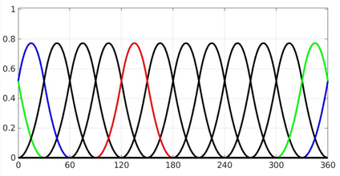
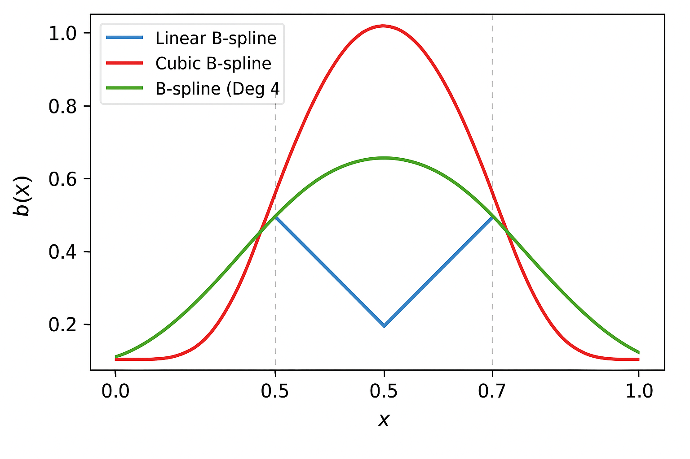

# Module 4B Parametric Splines {.unnumbered}

```{r, include=FALSE, echo=FALSE, message=FALSE, warning=FALSE}
colorize <- function(x, color) {
  if (knitr::is_latex_output()) {
    sprintf("\\textcolor{%s}{%s}", color, x)
  } else if (knitr::is_html_output()) {
    sprintf("<span style='color: %s;'>%s</span>", color, x)
  } else x
}

```

{fig-align="center"}

### Motivation and Examples

::: {.callout-important .illustration style="color: red"}
## Motivation:

So far, we have explored **Basis Expansion** in approaches such as polynomial regression and piecewise regression, where the response variable is divided into subregions and modeled separately with different polynomial functions.

`r colorize("Basis expansion is the overall process of transforming your predictors by expanding them into these basis functions.", "blue")`

However, piecewise regression has some key limitations:

-   It offers limited flexibility in capturing complex patterns.\
-   The fitted curves often lack smoothness at the knot points where the pieces meet.\
-   It can lead to models with high complexity and many parameters.

To address these issues, we now introduce **parametric splines**.

**Parametric splines** extend this idea by fitting piecewise polynomial functions that are smoothly connected at specified points called **knots**.

These approaches help us avoid mis-specifying the model's functional form, resulting in **more accurate fits**, **improved predictions**, and **valid statistical inference**, all while respecting the assumptions of linear regression.
:::

------------------------------------------------------------------------

## Introduction to Splines

Splines are a powerful class of functions used to model complex, non-linear relationships by joining piecewise polynomial segments in a smooth way. Unlike simple piecewise regression, splines ensure continuity and smoothness at the **knots**.

### General Form of a Polynomial Spline Model

A **polynomial spline** is a flexible modeling tool used to represent non-linear relationships. It constructs the regression function by piecing together polynomial functions that are joined at specific values of the predictor variable, known as **knots**.

The general form of a degree-$d$ polynomial spline with $M$ knots $k_1, k_2, \dots, k_M$ is:

$$
y_i = \beta_0 + \sum_{j=1}^d \beta_j x_i^j + \sum_{m=1}^M \gamma_m (x_i - k_m)^d_{+}
$$

where:

-   $d$ is the degree of the spline (e.g., 1 = linear, 2 = quadratic, 3 = cubic),
-   $k_m$ are the **knots**, where the segments of the spline are joined,
-   $(x_i - k_m)^d_{+} = \begin{cases}(x_i - k_m)^d & \text{if } x_i > k_m \\ 0 & \text{otherwise} \end{cases}$ is the **truncated power function**,
-   $\beta_j$ and $\gamma_m$ are coefficients estimated from the data.

This is referred to as the `r colorize("truncated power basis", "blue")`.

This form allows the spline to behave like a polynomial within each region defined by the knots, but with flexibility to change shape at each knot, while maintaining smoothness across the entire domain.

#### Polynomial Spline Examples

::: {.callout-tip appearance="minimal"}
-   **Linear spline** ($d = 1$):

    $$
    y_i = \beta_0 + \beta_1 x_i + \sum_{m=1}^M \gamma_m (x_i - k_m)_{+}
    $$

    -   Continuous at the knots, but the **slope is not smooth** --- the first derivative is discontinuous.
    -   Each $\gamma_m$ represents the **change in slope** at knot $k_m$.

-   **Quadratic spline** ($d = 2$):

    $$
    y_i = \beta_0 + \beta_1 x_i + \beta_2 x_i^2 + \sum_{m=1}^M \gamma_m (x_i - k_m)^2_{+}
    $$

    -   Ensures the function and its **first derivative are continuous** at the knots.

-   **Cubic spline** ($d = 3$):

    $$
    y_i = \beta_0 + \beta_1 x_i + \beta_2 x_i^2 + \beta_3 x_i^3 + \sum_{m=1}^M \gamma_m (x_i - k_m)^3_{+}
    $$

    -   Ensures continuity of the:
        -   Function itself,
        -   **First derivative** (slope),
        -   **Second derivative** (curvature).
:::

#### Practical Considerations

-   **Linear splines** are good for interpretability. You can explain the slope change at each knot.
-   **Cubic splines** are widely used for smooth fits. They provide excellent flexibility while maintaining a smooth shape.
-   For cubic splines, **individual coefficients are not typically interpreted** --- instead, we focus on the fitted curve.

------------------------------------------------------------------------

### `r colorize("Linear Splines", "green")`

A linear piecewise spline at knot locations 37 and 42 is specified as:

$$
y_i  = \beta_0 + \beta_1 x_i + \beta_2 (x_i - 37)_{+} + \beta_3 (x_i - 42)_{+} + \epsilon_i 
$$

-   For $x_i<37$

$$
y_i = \beta_0 + \beta_1 x_i
$$

-   For $37 \leq x_i < 42$

$$
\begin{align*}
y_i & = \beta_0 + \beta_1 x_i + \beta_2 (x_i - 37)_+ \\
&=  (\beta_0 - \beta_2 * 37) + (\beta_1 + \beta_2) x_i
\end{align*}
$$

-   For $42 \geq x_i$

$$
\begin{align*}
y_i & = \beta_0 + \beta_1 x_i + \beta_2 (x_i - 37)_+ + \beta_3 (x_i - 42)_+\\
& = (\beta_0 - 37\beta_2   - 42\beta_3) + (\beta_1 + \beta_2 + \beta_3) x_i
\end{align*}
$$

-   $\beta_2$ and $\beta_3$ represent [changes]{.underline} in slope compared to the previous region.

Note here we only need 4 regression coefficients compared to 6 in the model that does not force connections at knots.

```{r}
load(paste0(getwd(), "/data/GAbirth.RDATA"))
#Linear Splines
Sp1 = (dat$gw - 37) * as.numeric(dat$gw >= 37)
Sp2 = (dat$gw - 42) * as.numeric(dat$gw >= 42)
fit7 <- lm(bw ~ gw + Sp1 + Sp2, data = dat)
```

```{r, echo=F}

Ind1 = dat$gw >= 37 & dat$gw <= 41 #Full term indicator
Ind2 = dat$gw >= 42                #Post-term indicator

fit4 = lm (bw~gw*(Ind1+ Ind2), data = dat)


morepoints = seq(26, 44, .1)
newdata = data.frame(gw=morepoints, Sp1= (morepoints-37), Sp2=(morepoints-42) )
# non-zero for values greater than 36.5 and greater than 41.5 only:
newdata[ newdata <0] = 0

plot (dat$bw~dat$gw, xlab = "Gestational Week", ylab = "Birth weight")
lines (fit4$fitted[Ind1]~dat$gw[Ind1], col = 2, lwd = 3)
lines (fit4$fitted[Ind2]~dat$gw[Ind2], col = 2, lwd = 3)
lines (fit4$fitted[!Ind1 & !Ind2]~dat$gw[!Ind1 & !Ind2], col = 2, lwd = 3)

lines (predict (fit7, newdata=newdata)~morepoints, col = 4, lwd = 1.5)
abline (v=c(37, 42), col = "grey", lwd = 3)
legend ("topleft", legend=c("Piecewise linear", "Linear splines"), col=c(2,4), lwd=3)

summary(fit7)
```

**Interpretation:**

-   The model fits birthweight `bw` as a piecewise linear function of gestational week `gw` with knots at 37 and 42 weeks.

-   **Intercept (-4759.3):** The estimated birthweight when `gw = 0` (outside the observed range, mainly a baseline reference).

-   **Coefficient for `gw` (214.6):** For gestational weeks **before 37**, each additional week increases birthweight by approximately 214 grams.

-   **Coefficient for `Sp1` (-122.3):** After 37 weeks, the slope changes by `-122.3`, so the weekly increase in birthweight slows down to about `214.6 - 122.3 = 92.3` grams per week between 37 and 42 weeks.

-   **Coefficient for `Sp2` (-154.3):** After 42 weeks, the slope decreases further by 154.3, leading to a smaller or potentially negative increase in birthweight beyond this point.

-   **Model fit:**

    -   Residual standard error of 113 grams indicates typical prediction errors around this value.\
    -   Multiple `R^2 = 0.874` shows the model explains 87.4% of the variance in birthweight, indicating a strong fit.

------------------------------------------------------------------------

### `r colorize("Cubic Splines", "green")`

Linear splines fit piecewise linear functions joined at knots. They are easy to interpret and continuous, but their slope (first derivative) is not smooth at the knots, which can create sharp changes.

**Cubic splines** improve upon piecewise linear or quadratic models by fitting **piecewise cubic polynomials** that are **smoothly joined at the knots**. Specifically:

-   The **function itself** is continuous at the knots.\
-   The **first derivative** (i.e., the slope) is continuous, ensuring **no sharp changes in direction**. `r colorize("If the first derivative is not continuous at the knots, the slope can abruptly change—causing visible kinks or corners in the curve.", "blue")`
-   The **second derivative** is also continuous, which ensures **smooth curvature** across the entire domain. `r colorize("If the second derivative is not continuous at a knot, the curve may still look smooth, but it will change curvature abruptly — like a bend that's not sharp, but still visually unnatural.", "blue")`

This level of continuity results in a smooth, natural-looking curve without abrupt bends or changes in slope. Because cubic splines ensure smoothness up to the second derivative, they are commonly used for modeling smooth nonlinear relationships.

The cubic spline with knots at $\kappa_1$ and $\kappa_2$ can be written as:

$$
g(x_i) = \beta_0 + \beta_1 x_i + \beta_2 x_i^2 + \beta_3 x_i^3 + \beta_4 (x_i - \kappa_1)_+^3 + \beta_5 (x_i - \kappa_2)_+^3
$$

where

$$(x - \kappa)_+^3 =
\begin{cases}
  (x - \kappa)^3, & \text{if } x > \kappa, \\
  0, & \text{otherwise.}
\end{cases}$$

and $(\kappa_1, \kappa_2) = (37, 42)$.

```{r}
#Cubic Splines
Sp1 = (dat$gw - 37)^3*as.numeric(dat$gw >= 37 )
Sp2 = (dat$gw - 42)^3*as.numeric(dat$gw >= 42)
fit8 = lm (bw~ gw+I(gw^2) + I(gw^3) + Sp1 + Sp2, data = dat)
# summary(fit8)

```

| Term | Estimate | Std. Error | t-value | p-value | Interpretation |
|----|----|----|----|----|----|
| **Intercept** | 28,900 | 3,717 | 7.78 | \< 0.001 | Baseline value when all terms are zero (not directly interpretable since `gw = 0` is out of range). |
| **gw** | -2,968 | 333 | -8.90 | \< 0.001 | Negative linear effect of gestational week. |
| **gw²** | 99.7 | 9.9 | 10.07 | \< 0.001 | Positive curvature --- indicates increasing marginal effect of `gw`. |
| **gw³** | -1.04 | 0.097 | -10.64 | \< 0.001 | Controls for further curvature in the relationship. |
| **Sp1** | 0.773 | 0.248 | 3.12 | 0.0019 | Additional cubic adjustment **after 37 weeks**. |
| **Sp2** | 7.455 | 3.471 | 2.15 | 0.0318 | Additional cubic adjustment **after 42 weeks**. |

```{r, echo=F, warning=F, message=F}
plot(dat$gw, dat$bw, col = "black", xlab = "GW", ylab = "BW")
abline(v = 37)
abline(v = 42)
lines (predict (fit7, newdata=newdata)~morepoints, col = "red", lwd = 3)
lines(sort(dat$gw), sort(fit8$fitted.values), col = "blue", lwd = 1)
legend("topleft", legend = c("Linear splines", "Cubic splines"),
       col = c("red", "blue"), lwd = 2)
```

------------------------------------------------------------------------

### `r colorize("Basis (B-) Splines", "green")`

Parametric splines (linear, quadratic, cubic) fit nonlinear patterns by joining polynomial pieces at knots. In the truncated power basis, however, dense knots or higher degrees can make the design matrix ill-conditioned, inflate variance, and create boundary wiggles. **B-splines** reparameterize the spline space into well-behaved, localized basis functions, improving numerical stability while preserving the same function space.

Think of each B-spline basis function as a smooth, localized "bump." Only a small neighborhood near a few adjacent knots matters for any one basis. Summing these overlapping bumps with data-estimated weights produces a smooth curve that adapts locally without disturbing the whole fit when one region changes.

#### Model Setup

We model the mean as a linear combination of B-spline basis functions:

$$
\begin{aligned}
y_i &= \mu(x_i) + \varepsilon_i,\quad \varepsilon_i \sim N(0,\sigma^2),\\
\mu(x_i) &= \sum_{k=1}^{K} \beta_k\, b_k^{(d)}(x_i),
\end{aligned}
$$

or in matrix form, $\boldsymbol{\mu}=\mathbf{B}\boldsymbol{\beta}$ with entries $B_{ik}=b_k^{(d)}(x_i)$. For a fixed degree $d$ and knot set, every spline can be written as a linear combination of these $b_k(\cdot)$.

**Choosing the Degree of the B-Spline:** The degree ($d$) determines the polynomial order and smoothness of the fitted curve.

| **Spline Type** | **Degree (**$d$) | **Functional Form** | **Model Form** | **Continuity at Knots** | **Interpretation** |
|:---|:--:|:---|:---|:---|:---|
| **Linear** | 1 | Piecewise straight lines | $\mu(x)=\sum_k\beta_k b_k^{(1)}(x)$ | Continuous function ($C^0$) | Changes in slope at knots; easy to interpret |
| **Quadratic** | 2 | Piecewise parabolas | $\mu(x)=\sum_k\beta_k b_k^{(2)}(x)$ | Continuous slope ($C^1$) | Smooth slope transitions between segments |
| **Cubic** | 3 | Piecewise cubic curves | $\mu(x)=\sum_k\beta_k b_k^{(3)}(x)$ | Continuous slope and curvature ($C^2$) | Smoothest; preferred in most applications |

#### Recursive Definition of B-spline Basis Functions

B-spline bases of higher degree are constructed recursively from lower-degree functions:

$$
b_k^{(0)}(x) = \begin{cases}
1, & \tau_k \le x < \tau_{k+1}\\
0, & \text{otherwise}
\end{cases}
$$

$$
b_k^{(d)}(x) = \frac{x-\tau_k}{\tau_{k+d}-\tau_k}b_k^{(d-1)}(x)
+ \frac{\tau_{k+d+1}-x}{\tau_{k+d+1}-\tau_{k+1}}b_{k+1}^{(d-1)}(x)
$$

with terms having zero denominators defined as 0. This recursive formulation ensures local support and built-in smoothness across knots.

#### Visual Comparison



The higher the degree, the smoother the spline:

-   Linear → sharp slope changes\
-   Quadratic → gentle curves\
-   Cubic → continuous curvature and smooth transitions

#### Why B-splines Work Well

Local support keeps each basis function nonzero over only a short interval, which improves conditioning and computation. Smoothness is built in: a degree-$d$ B-spline is continuous with continuous derivatives up to order $d-1$ at each knot. Coefficients are not meant to be interpreted individually; the fitted curve $\mu(x)$ is the target.

::: callout-note
**Rule of thumb.** Use cubic B-splines (degree = 3) for smooth regression curves. Choose knot number and placement pragmatically (e.g., quantiles of $x$ or evenly spaced over the data range). B-splines also integrate naturally with penalties and GAMs when you want automatic smoothness selection.
:::

------------------------------------------------------------------------

### Fitting B-Splines in R

```{r, echo = T}
library(splines)    

    #Linear splines
    fit1 <- lm(bw ~ bs(gw, knots = c(37, 42), degree=1), data = dat)
    #Quadratic splines
    fit2 <- lm(bw ~ bs(gw, knots = c(37, 42), degree=2), data = dat)
    #Cubic splines
    fit3 <- lm(bw ~ bs(gw, knots = c(37, 42), degree=3), data = dat)
```

```{r, echo = F}
   
  # Create a fine grid for smooth plotting
gw_grid <- seq(min(dat$gw), max(dat$gw), length.out = 300)
pred_df <- data.frame(gw = gw_grid)

# Predict fitted values on the grid
pred_df$fit1 <- predict(fit1, newdata = pred_df)
pred_df$fit2 <- predict(fit2, newdata = pred_df)
pred_df$fit3 <- predict(fit3, newdata = pred_df)

# Plot
plot(dat$gw, dat$bw, pch = 16, col = "grey60",
     xlab = "Gestational Week (gw)", ylab = "Birthweight (bw)",
     main = "Comparison of Spline Degrees with Knots at 37 and 42")

lines(pred_df$gw, pred_df$fit1, col = "red",   lwd = 3)
lines(pred_df$gw, pred_df$fit2, col = "blue",  lwd = 3)
lines(pred_df$gw, pred_df$fit3, col = "green", lwd = 3)

abline(v = c(37, 42), lty = 2, col = "black")  # Show knot locations

legend("topleft",
       legend = c("Linear Bspline (degree = 1)", 
                  "Quadratic Bspline (degree = 2)", 
                  "Cubic Bspline (degree = 3)"),
       col = c("red", "blue", "green"),
       lwd = 3, bty = "n")  
    
```

**Model Interpretation:**

-   **Role of Coefficients**:

    -   In a spline model, the estimated coefficients $\beta_k$ represent the contribution of each B-spline basis function $b_k(x)$ to the overall predicted value of the response variable $\mu(x)$.

    -   Each coefficient $\beta_k$ adjusts the height and influence of its corresponding B-spline function across the range of $x$.

-   **Effect on the Prediction**:

    -   The overall model prediction $\mu(x)$ is a linear combination of the B-spline basis functions weighted by their respective coefficients. Thus, the predicted value at a given $x$ is influenced by the specific values of these coefficients and the corresponding basis functions evaluated at $x$.

-   **Local Interpretation**:

    -   The interpretation of a specific coefficient $\beta_k$ is often local rather than global:

        -   If $\beta_k$ is positive, it indicates that the B-spline function $b_k(x)$ contributes positively to the predicted value of $\mu(x)$ in the range where $b_k(x)$ is non-zero.

        -   If $\beta_k$ is negative, it implies a negative contribution from $b_k(x)$ in its active range.

-   **Influence of Knots**:

    -   The placement of knots influences the shape of the spline and, consequently, how the coefficients interact with the data:

        -   The regions between knots allow for changes in the slope and curvature of the spline. Thus, the coefficients can be seen as controlling the smooth transitions between these segments.

------------------------------------------------------------------------

### `r colorize("Data Description: NYC Daily Mortality and Air Pollution Dataset", "green")`

The dataset contains **daily time-series data from New York City** and is widely used in environmental epidemiology for demonstrating regression and smoothing techniques. The data were originally compiled as part of **NMMAPS**, a multi-city study assessing the short-term health effects of air pollution across major U.S. cities. New York City serves as a canonical example for time-series regression because it exhibits:

-   pronounced **seasonal and temperature-related mortality patterns**, and\
-   measurable day-to-day variation in **PM₂.₅** (fine particulate matter).

Each observation represents **one day** of data for New York City between **2001 and 2005**.\
The dataset includes information on **daily mortality counts**, **air-pollution levels**, and **meteorological variables** such as temperature and dew-point temperature.

| **Variable** | **Description** |
|:---|:---|
| `date` | Calendar date (YYYY-MM-DD). |
| `alldeaths` | Total number of all-cause deaths per day in New York City. |
| `age65plus` | Number of daily deaths among individuals aged 65 years and older. |
| `cardioresp` | Daily number of deaths from cardiovascular or respiratory causes (all ages). |
| `cr65plus` | Cardiovascular or respiratory deaths among those aged 65+. |
| `dow` | Day of the week (Monday -- Sunday). |
| `pm25` | Daily mean fine particulate-matter concentration (µg/m³). |
| `Temp` | Daily mean ambient temperature (°F). |
| `DpTemp` | Daily mean dew-point temperature (°F). |
| `rmTemp` | Running mean temperature (typically a 3- or 5-day moving average). |
| `rmDpTemp` | Running mean dew-point temperature. |

```{r}
# Load data
load(file.path(getwd(), "data", "NYC.RData"))  # expects object `health`

# Ensure date is numeric for bs(); keep original for labeling
health$date_num <- as.numeric(health$date)

plot_bs_panel <- function(df, main_title) {
  # Build a common prediction grid (sorted by date)
  ord   <- order(health$date)
  xgrid <- data.frame(date      = health$date[ord],
                      date_num  = health$date_num[ord])

  # Fit linear/quadratic/cubic B-splines in a compact way
  f1 <- lm(alldeaths ~ bs(date_num, df = df, degree = 1), data = health)
  f2 <- lm(alldeaths ~ bs(date_num, df = df, degree = 2), data = health)
  f3 <- lm(alldeaths ~ bs(date_num, df = df, degree = 3), data = health)

  # Number of interior knots=df−(d+1)
  
  
  # Predicted values on sorted grid
  p1 <- predict(f1, newdata = xgrid)
  p2 <- predict(f2, newdata = xgrid)
  p3 <- predict(f3, newdata = xgrid)

  # Grab interior knots for the linear case (they’re the same knot locations for a given df)
  B  <- bs(health$date_num, df = df, degree = 1)
  ks <- attr(B, "knots")

  # Scatter + fitted lines
  plot(health$alldeaths ~ health$date, col = "grey60", pch = 16, cex = 0.6,
       xlab = "Date", ylab = "Daily deaths", main = main_title)
  lines(xgrid$date_num, p1, col = 2, lwd = 3)
  lines(xgrid$date_num, p2, col = 4, lwd = 3)
  lines(xgrid$date_num, p3, col = 5, lwd = 3)

  # Show interior knots
  if (!is.null(ks) && length(ks) > 0) abline(v = as.Date(ks, origin = "1970-01-01"),
                                             col = "grey80", lty = 2)

  legend("topleft",
         legend = c("Linear (deg=1)", "Quadratic (deg=2)", "Cubic (deg=3)"),
         col = c(2, 4, 5), lwd = 3, bty = "n", cex = 1.0)
}

# Two-panel comparison: df = 10 vs df = 20
op <- par(mfrow = c(1, 2), mar = c(4, 4, 4, 1))
plot_bs_panel(df = 10, main_title = "B-splines on Date (df = 10)")
plot_bs_panel(df = 20, main_title = "B-splines on Date (df = 20)")
par(op)
```

#### Choices we have to make:

-   We need to pick:

    -   Which basis function? Linear versus Cubic

    -   How many knots?

    -   Where to put the knots?

-   Choice of basis function usually does not have a large impact on model fit, especially when there are enough knots and $g(x)$ is smooth.

-   When there are enough knots, their locations are less important too! By "enough" this means distance between them is small enough to capture fluctuations.

-   So **how many knots?** is the question.

::: {.callout-important style="color: red"}
***Bias- Variance Tradeoff***

-   More knots-\>

    -   can better capture fine scale trends

    -   Need to estimate more coefficients (risk of overfitting)

    -   Below shows cubic splines with different number of knots.

```{r, echo=F}
fit1 = lm (alldeaths~bs (date_num, df = 10), data = health)
fit2 = lm (alldeaths~bs (date_num, df = 20), data = health)
fit3 = lm (alldeaths~bs (date_num, df = 30), data = health)
fit4 = lm (alldeaths~bs (date_num, df = 50), data = health)


plot (health$alldeaths~health$date, col = "grey", xlab = "Date", ylab = "Death")
lines (fit1$fitted~health$date_num, col = 2, lwd = 3)
lines (fit2$fitted~health$date_num, col = 4, lwd = 3)
lines (fit3$fitted~health$date_num, col = 5, lwd = 3)
lines (fit4$fitted~health$date_num, col = 6, lwd = 3)
 legend ("topleft", legend=c("10 df", "20 df", "30 df", "50 df"), col=c(2,4, 5, 6), lwd=3, cex = 1.3, bty= "n")


```
:::

------------------------------------------------------------------------

### `r colorize("Model Assessment: Bias–Variance and Cross-Validation", "green")`

Assume the data come from some *true* underlying model:

$$
Y = g(X) + \varepsilon, \quad \varepsilon \sim N(0, \sigma^2)
$$

Here:

-   $g(X)$ is the *true, unknown regression function*, and\
-   $\varepsilon$ is random noise, independent of $X$.

Our goal is to estimate $g(X)$ with a model $\hat{g}(X)$ that predicts new observations accurately.

For a given $x_i$:

$$
\hat{Y}_i = \hat{g}(x_i)
$$

and we assume $g(x_i) \perp \varepsilon_i$ (the model and noise are independent). We use several metrics to assess model fit:

**1. Population Mean Squared Error (MSE):** The **expected squared difference** between the true $Y$ and its estimate $\hat{g}(x)$ defines the *population Mean Squared Error* (MSE):

$$
\text{MSE} = E[(Y - \hat{g}(X))^2]
$$

Expanding this expectation gives the classic **bias--variance decomposition**:

$$
E[(Y - \hat{g}(X))^2] =
\underbrace{\sigma^2}_{\text{Irreducible error}}
+ \underbrace{[E(\hat{g}(X)) - g(X)]^2}_{\text{Bias}^2}
+ \underbrace{E[(\hat{g}(X) - E[\hat{g}(X)])^2]}_{\text{Variance}}
$$

-   **Bias** measures how far the *average fitted curve* is from the true function $g(x)$.\
-   **Variance** measures how much the fitted function $\hat{g}(x)$ fluctuates across samples.\
-   The **irreducible error** $\sigma^2$ cannot be reduced no matter how good our model is.

Our goal is to choose a model that **minimizes the MSE**, balancing **bias and variance**.

**2. Estimating Prediction Error: Cross-Validation:** In practice, the true $g(x)$ and $\sigma^2$ are unknown, so we approximate MSE using **cross-validation**.

Let $\hat{g}^{(-i)}(x_i)$ denote the predicted value for $y_i$ obtained by fitting the model on all observations *except* the $i^{th}$ one.\
Then the **Leave-One-Out Cross-Validation (LOOCV)** statistic is:

$$
CV = \frac{1}{n} \sum_{i=1}^{n} \big(y_i - \hat{g}^{(-i)}(x_i)\big)^2
$$

This provides an **approximately unbiased estimate of the population MSE**:

$$
CV \approx E[(Y - \hat{g}(X))^2]
$$

**Interpretation:**

-   Cross-validation mimics how well our model predicts *new* unseen data.\
-   A model with low CV error generalizes well beyond the training sample.\
-   **We choose the model (or smoothing level) that minimizes CV.**

#### Overfitting and Underfitting

The **bias--variance tradeoff** determines whether a model overfits or underfits the data.

| **Model Behavior** | **Description** | **Bias** | **Variance** | **Example (Splines)** |
|:---|:---|:--:|:--:|:---|
| **Overfitting** | Model captures noise rather than the true signal ($\hat{g}(x_i) \approx g(x_i) + \varepsilon_i$). | Low | High | Very wiggly spline; too many knots or high `df`. |
| **Underfitting** | Model too simple to capture the structure ($\hat{g}(x_i)$ is overly smooth). | High | Low | Almost flat spline; too few knots or low `df`. |

From the **spline perspective**:

-   Very **wiggly** splines → **high variance**, low bias.\
-   Very **smooth** splines → **high bias**, low variance.

We aim for the **sweet spot**: smooth enough to generalize, flexible enough to fit structure.

**From Hastie, Tibshirani & Friedman (2009):**\
"Discussions of error rate estimation can be confusing because we must be clear which quantities are fixed and which are random."\
CV keeps $x_i$ fixed and estimates prediction error over different possible samples of $\varepsilon_i$.

------------------------------------------------------------------------

## `r colorize("Summary", "purple")`

| **Section** | **Description** |
|----|----|
| **Model Setup** | Unknown regression function modeled via **basis expansion**: <br> $y_i = g(x_i) + \varepsilon_i,\ \varepsilon_i\sim N(0,\sigma^2)$ <br> $g(x_i) = \sum_{m=1}^M \beta_m\, b_m(x_i)$. |
| **Truncated Power (Parametric) Splines** | Polynomial plus **knoted adjustments** using truncated terms: <br> $y_i = \beta_0 + \sum_{j=1}^d \beta_j x_i^j + \sum_{m=1}^M \gamma_m (x_i-k_m)_+^{\,d}$, where $(x-\kappa)_+^{\,d} = (x-\kappa)^d\mathbf{1}\{x>\kappa\}$. <br> Flexible, but can be **numerically unstable** with many knots/high degree. |
| **Continuity by Degree** | **Linear (**$d=1$): $C^0$ (function continuous; slope can jump). <br> **Quadratic (**$d=2$): $C^1$ (continuous slope). <br> **Cubic (**$d=3$): $C^2$ (continuous curvature) --- typically preferred. |
| **Linear Spline (worked form)** | With knots $36.5, 41.5$: <br> $y_i=\beta_0+\beta_1 x_i+\beta_2(x_i-36.5)_+ + \beta_3(x_i-41.5)_+ + \varepsilon_i$. <br> Slope changes are $\beta_2,\beta_3$; segments share continuity at knots. |
| **Cubic Spline (worked form)** | With knots $\kappa_1,\kappa_2$: <br> $g(x_i)=\beta_0+\beta_1x_i+\beta_2x_i^2+\beta_3x_i^3+\beta_4(x_i-\kappa_1)_+^{\,3}+\beta_5(x_i-\kappa_2)_+^{\,3}$. <br> Ensures continuity of function, slope, and curvature. |
| **B-Splines (Basis Splines)** | Reparameterize the same spline space into **localized, well-conditioned** basis functions (smooth "bumps" with **local support**). <br> Model: $\mu(x_i)=\sum_{k=1}^K \beta_k\, b_k^{(d)}(x_i)$, with design matrix $B_{ik}=b_k^{(d)}(x_i)$. <br> **Cox--de Boor recursion** builds $b_k^{(d)}$ from $b_k^{(d-1)}$; zero-denominator terms treated as 0. |
| **Why B-Splines?** | Better **numerical stability**, **sparser** design (local support), easy to increase flexibility, and natural for penalties/GAMs. Coefficients are **not** directly interpretable; focus on the **fitted curve**. |
| **Degrees of Freedom & Knots** | In `splines::bs()`, **df = number of basis columns** (no intercept). For degree $d$: <br> **Interior knots** $=$ $\text{df}-(d+1)$. <br> More df ⇒ more flexibility (risk of variance/overfit). |
| **Choosing Knots** | Start with **quantiles** or **even spacing** over $x$. With **enough knots**, exact locations matter less than the **number** of knots for smooth $g(x)$. |
| **R Quick Reference** | **Fixed knots:** `bs(x, knots = c(...), degree = 1/2/3)` <br> **By df:** `bs(x, df = 10, degree = 3)` <br> **Extract knots:** `attr(bs_obj, "knots")` <br> **Cubic (common):** `degree = 3` <br> **Date x:** convert to numeric first. |
| **Interpretation (Local)** | Each $\beta_k$ primarily affects $\mu(x)$ where $b_k^{(d)}(x)$ is nonzero (near its knot span). Changes in knots/df change **where/how** the curve can flex. |
| **Model Assessment** | **MSE decomposition:** $E[(Y-\hat g(X))^2]=\sigma^2+\text{Bias}^2+\text{Var}$. <br> **CV (LOOCV):** $\text{CV}=\frac{1}{n}\sum_{i}(y_i-\hat g^{(-i)}(x_i))^2$ ≈ test error. <br> Pick df/knots to **minimize CV**, balancing bias--variance. |
