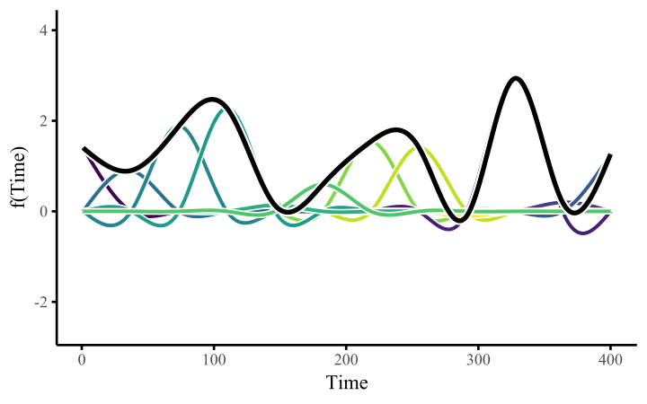

# Module 5A Generalized Additive Models {.unnumbered}

```{r, include=FALSE, echo=FALSE, message=FALSE, warning=FALSE}
colorize <- function(x, color) {
  if (knitr::is_latex_output()) {
    sprintf("\\textcolor{%s}{%s}", color, x)
  } else if (knitr::is_html_output()) {
    sprintf("<span style='color: %s;'>%s</span>", color, x)
  } else x
}

```



**Reading**

-   From Wood, S. Generalized Additive Models: An Introduction with R, 2nd Edition.

-   A nice resource for fitting GAMS: <https://wiki.qcbs.ca/r_workshop8>

-   Another fun resource for seeing GAMs: <https://ecogambler.netlify.app/blog/interpreting-gams/>

**Basic Concepts**

-   Generalized Additive Models for non-normal data.
-   Additive models with multiple covariates.
-   Using $gam()$ in package $mgcv()$ to fit semiparametric models with parametric slopes and nonparametric terms.
-   Bivariate splines
-   Interpreting non-linear effects

### Motivation and Examples

::: {.callout-important .illustration style="color: red"}
## Motivation

In Module 4 we learned about basis expansions and parametric splines. These introduce smooth functions to capture non-linear relationships between outcome and covariates. We saw examples where:

-   The outcome is Gaussian.

-   There is one non-linear covariate

[How can we extend this to **multivariable and non-normal** settings while keeping models interpretable and smoothness **data-driven**?]{.underline}

Answer: **Generalized Additive Model**: A GAM models the mean via a link: $$
g\!\big(\mathbb{E}[Y]\big) = \beta_0 + \sum_{j=1}^p s_j(X_j),
$$ where $g(\cdot)$ is the link, $s_j(\cdot)$ are smooth functions (e.g., splines), and $p$ is the number of predictors.

where:

-   $Y$ is the response variable,

-   $g()$ is the link function that relates the expected value of $Y$ $(E(Y)$ to the linear predictor.

-   $\beta_0$ is the intercept term.

-   $s_j(X_j)$ are smooth functions, such as splines, applied to the predictor variable $X_j$.

-   $p$ is the number of predictor variables.

-   Each smooth function $s_j(\cdot)$ allows for greater flexibile, non-linear relationships between $Y$ and $X_j$.

**Why GAMs?**

-   **Flexible:** captures separate nonlinear effects $s_j(X_j)$ for each predictor.
-   **Interpretable:** additive structure → clear partial effects and plots.
-   **Automatic smoothing:** each $\lambda$ is learned from the data (e.g., REML/GCV).
-   **Extensible:** include factors, linear terms, and **interactions** via tensor-product smooths (e.g., $s_{12}(x_1,x_2)$).
:::

**Motivating Example: Low Birthweight in GA** Recall from example in Module 3.

Dataset: a cohort of live births from GA born in the year 2001 (N=77,340)

Variables:

-   $ptb$: indicator for preterm birth for whether baby from pregnancy $i$ was born \<37 weeks.

-   $age$: mothers age at delivery

-   $male$: indicator of baby's sex (1=male, 0=female)

-   $tobacco$: indicator for mother tobacco use during pregnancy test (1=yes, 0=no)

In previous analysis, we fit this using a logistic regression model, which assumed a Bernoulli data model with a logit-link. We regressed the outcome (probability of low-birth weight) on age, sex, and tobacco status.

But we may want to account for non-linear age effect:

$$
\begin{aligned}
\text{ptb}_i &\sim \text{Bernoulli}(p_i),\\
\text{logit}(p_i) &= \beta_0 + \beta_1\,\text{male}_i + \beta_2\,\text{tobacco}_i + s(\text{age}_i).
\end{aligned}
$$

where $s(age_i)$ is a `r colorize("smooth", "red")` function of age.

::: {.callout-note style="color: gray" appearance="minimal" icon="false"}
Note: By default, `mgcv::gam()` uses cubic regression splines `(bs = "cr")` with k = 10 basis functions (including the intercept of the smooth).
:::

```{r, warning = F, message = F}

library (mgcv)
library(ggplot2)
library(dplyr)
# Pre-term births with non-linear age effect
load(paste0(getwd(), '/data/PTB.RData'))

fit.gam = gam(ptb~ s(age) + male + tobacco ,
              family = binomial, data = dat)
summary(fit.gam)
```

**Model Interpretation:**

-   The response variable `ptb` is modeled using a **binomial family** with a **logit link function**.

-   The formula includes:

    -   A smooth term for `age` (`s(age)`).
    -   Linear terms for `male` and `tobacco`.

-   **Intercept**: The log-odds of `ptb` when all predictors are at their reference levels is estimated as $-2.44$ (highly significant, $p < 2 \times 10^{-16}$).

-   **`maleM` (male effect)**: Being male is associated with a small but significant increase in the log-odds of `ptb` (estimate = $0.073$, $p = 0.00494$). Tobacco use is associated with a significant increase in the log-odds of `ptb` (estimate = $0.39$, $p < 3.24 \times 10^{-13}$).

-   Smooth Term for Age (`s(age)`) : The smooth function for `age` has an estimated **effective degrees of freedom (edf)** of $3.31$, indicating a moderately flexible relationship. Is highly significant ($p < 2 \times 10^{-16}$), suggesting a non-linear relationship between age and the log-odds of `ptb`.

-   **Adjusted** $R^2$: The model explains only $0.177\%$ of the variability in the response, indicating weak predictive power.

-   **Deviance explained**: The model accounts for $0.304\%$ of the total deviance, further supporting limited explanatory capability. -

-   **UBRE score**: - A measure of model fit, with a value of $-0.42095$. UBRE is similar to AIC for non-normal data: [Lower is better!]{.underline}

-   **Sample size**: - The model was fit on $77,340$ observations.

Conclusion: While the predictors (`age`, `male`, and `tobacco`) show significant associations with `ptb`, the overall model has limited explanatory power for predicting `ptb`.

------------------------------------------------------------------------

## Checking GAMs

```{r}
mgcv::gam.check(fit.gam)
```

**Interpretation:**

-   Residual plots for fitted values are a good way to check residuals in the normal case. But for binary outcomes, they look odd and are not helpful.
-   $k' = 9\rightarrow$ the smooth for `age` was represented using 9 basis functions (default).
-   $edf=3.31\rightarrow$ the effective degrees of freedom are much lower than 9, indicating that the smooth for `age` is relatively simple- not over wiggly or overfitted. It if is close to $k$ then it is overfitting.
-   $k-index = 0.94$ and $p-value = 0.44 \rightarrow$
    -   No evidence that the basis dimension $k$ is too small.
    -   The smooth has enough flexibility to capture the nonlinear pattern in age.
    -   If the k-index were close to 0 or p-value \< 0.05, it would suggest that the smooth is constrained by too few basis functions and should be increased.

`r colorize("Looking at the plot below, what is the trend of age and preterm birth?", "blue")`

```{r, echo=F}
par(mar = c(5, 5, 2, 1))
plot(fit.gam,
     shade = TRUE, shade.col = "skyblue",
     seWithMean = TRUE,
     pch = 19, cex = 0.6, col = "darkgray",
     xlab = "Age (years)",
     ylab = "Smooth effect on log-odds of preterm birth",
     main = "Estimated Smooth Function for Age",
     lwd = 2)
abline(h = 0, lty = 2, col = "gray40")
```

Biologically, log-odds of preterm birth is higher at very young ages, lowest around 29 years, and then increased again.

------------------------------------------------------------------------

## Multiple Smoothers

So far, we have focused on fitting a single smooth function. In real-world applications, we often have **multiple predictors**, each contributing its own nonlinear effect on the response. This leads to **additive models** with multiple smooth components.

Consider the model with two continuous variables $x_i$ and $z_i$:

$$
y_i = \beta_0 + g_1(x_i) + g_2(z_i) + \varepsilon_i, 
\quad \varepsilon_i \sim N(0, \sigma^2)
$$

Here:

-   $g_1(\cdot)$ and $g_2(\cdot)$ are smooth, potentially nonlinear functions of their respective predictors.\
-   The model can be extended to **generalized responses** (e.g., binomial, Poisson) through an appropriate link function.

Each smooth can be written as a basis expansion with a curvature penalty: $$
\begin{aligned}
g_1(x) &= \sum_{m=1}^{M_1} \beta_{m1}\, b_{m1}^{(d)}(x),\qquad
g_2(z)  = \sum_{m=1}^{M_2} \beta_{m2}\, b_{m2}^{(d)}(z),
\end{aligned}
$$ with roughness penalties

$$
\lambda_1 \int \big[g_1''(x)\big]^2\,dx \;+\; \lambda_2 \int \big[g_2''(z)\big]^2\,dz.
$$

We add **penalization to each term** to induce smoothness so that each function remains flexible but avoids overfitting.

**Penalized Least Squares Criterion:** The spline coefficients are estimated by minimizing:

$$
\sum_{i=1}^n (y_i - \hat{y}_i)^2
\;\;+\;\;
\lambda_1 \int \big[g_1''(x)\big]^2\,dx
\;\;+\;\;
\lambda_2 \int \big[g_2''(z)\big]^2\,dz,
$$

where the first term measures **model fit**, and the remaining terms penalize curvature of the smooth functions.

Or, in **matrix form**:

$$
\min_{\boldsymbol{\beta}}
\left\{
\;\|\mathbf{y} - \mathbf{X}\boldsymbol{\beta}\|^2
\;+\;
\lambda_1\, \boldsymbol{\beta}_1^\top \mathbf{K}_1 \boldsymbol{\beta}_1
\;+\;
\lambda_2\, \boldsymbol{\beta}_2^\top \mathbf{K}_2 \boldsymbol{\beta}_2
\right\},
$$

where:

-   $\mathbf{X}$ is the **design matrix** containing all spline basis functions,
-   $\mathbf{K}_1$ and $\mathbf{K}_2$ are **penalty matrices** encoding curvature,
-   $\lambda_1$ and $\lambda_2$ control how **wiggly** each smooth is allowed to be.

------------------------------------------------------------------------

`r colorize("Generalized Additive Model Form (any link & family)", "red")`

$$
g\!\big(\mathbb{E}[Y_i]\big)
=
\beta_0
\;+\;
g_1(x_i)
\;+\;
g_2(z_i).
$$

Estimation proceeds by **penalized iteratively reweighted least squares**:

$$
\min_{\boldsymbol{\beta}}
\left\{
-\ell(\boldsymbol{\beta}\mid \mathbf{y})
\;+\;
\lambda_1\, \boldsymbol{\beta}_1^\top \mathbf{K}_1 \boldsymbol{\beta}_1
\;+\;
\lambda_2\, \boldsymbol{\beta}_2^\top \mathbf{K}_2 \boldsymbol{\beta}_2
\right\},
$$

where $\ell(\boldsymbol{\beta}\mid \mathbf{y})$ is the log-likelihood for the chosen GLM family (e.g., binomial, Poisson, quasi-Poisson).

------------------------------------------------------------------------

### Motivating Example: Air Pollution and Mortality

**Scientific Question:** What is the association between daily mortality counts and daily concentrations of fine particulate matter (PM₂.₅)?

**Context:**\
Fine particulate matter (PM₂.₅) consists of solid and liquid particles in the air with a diameter less than $2.5\,\mu\text{m}$. These particles mainly arise from:

-   Power generation,\
-   Vehicle emissions, and\
-   Industrial activities.

**Data Sources (New York City, 2001--2005):**

-   **Mortality Data:** Daily counts of non-accidental deaths (age ≥ 65) from the CDC.\
-   **Air Pollution Data:** Daily PM₂.₅ concentrations from the U.S. EPA.\
-   **Meteorology Data:** Temperature and humidity from the National Climatic Data Center (NOAA).

```{r, echo=FALSE, warning = F, message = F}
load(paste0(getwd(), '/data/NYC.RData'))
health$date2 <- order(health$date)
health$pm25.lag1 <- c(NA, health$pm25[1:1825])

par(mfrow = c(3,1), mar = c(2,4,1,1), cex.lab = 1.4, cex.axis = 1.4)

plot(health$cr65plus ~ health$date, xlab = "Date", ylab = "Deaths", col = "grey")
legend("topleft", legend = "Daily Non-Accidental Mortality", bty = "n", text.font = 2, cex = 1.3)

plot(health$pm25 ~ health$date, xlab = "Date", ylab = "PM2.5 (µg/m³)", col = "grey")
legend("topleft", legend = "Daily PM2.5 Concentrations", bty = "n", text.font = 2, cex = 1.3)

plot(health$Temp ~ health$date, xlab = "Date", ylab = "Temperature (°C)", col = "grey")
legend("topleft", legend = "Daily Temperature", bty = "n", text.font = 2, cex = 1.3)
```

## Time-Series Health Model

We are interested in the association between **daily variation** in mortality counts and **daily variation** in air pollution exposure (PM₂.₅). In a time-series design, the **population** serves as the unit of analysis---our outcome represents **total daily deaths** in a defined area. Time-varying confounders (e.g., temperature, humidity, long-term trends) are flexibly controlled using **smooth functions**.

**Temporal Lag**: There is often a **delay** between exposure and health response.We therefore model the association between **daily mortality** and **previous-day exposure**.

Let

-   $y_t$ denote the daily count of non-accidental deaths (age ≥ 65) on day $t$,\
-   $x_{t-1}$ be the **lag-1** PM₂.₅ concentration (exposure on the previous day), and\
-   $\text{DOW}_t$ denote the day of week (a categorical factor).

**GAM Formula**

We model the expected deaths with a log link (quasi-Poisson): $$
\begin{aligned}
\log \mathbb{E}[y_t]
&= \beta_0
\;+\; f_{\text{PM}}\!\big(x_{t-1}\big)
\;+\; \boldsymbol{\alpha}^{\top}\mathbf{1}\{\text{DOW}_t\}
\;+\; f_{\text{Season}}(\text{DOY}_t)
\;+\; f_{\text{Trend}}(t) \\
&\quad
\;+\; f_{\text{Temp}}(\text{Temp}_t)
\;+\; f_{\text{Dp}}(\text{DpTemp}_t)
\;+\; f_{\text{RMTemp}}(\text{rmTemp}_t)
\;+\; f_{\text{RMDp}}(\text{rmDpTemp}_t).
\end{aligned}
$$

Each $f_j$ is a penalized spline with

$$
f_j(u) = \sum_{m=1}^{k_j} \beta_{jm} b_{jm}(u)
$$

and penalty $\lambda_j\,\boldsymbol{\beta}_j^\top \mathbf{K}_j \boldsymbol{\beta}_j.$

#### Fitting in R

```{r, warning=F, message = F}
# Lag exposure variable
health$pm25_lag1 <- c(NA, head(health$pm25, -1))
health$doy <- as.integer(format(health$date, "%j"))   # Day of year
health$fdow <- factor(health$dow)
health$fdow <- relevel(health$fdow, ref = "Sunday")

fit <- gam(
  cr65plus ~ s(pm25_lag1) + fdow +
    s(doy, bs = "cc", k = 30) +             # cyclic annual seasonality
    s(date2, k = 100) +                     # long-term trend
    s(Temp) + s(DpTemp) +                   # same-day meteorology
    s(rmTemp) + s(rmDpTemp),                # running means (lagged effects)
  family = quasipoisson(link = "log"),
  data = health,
  method = "REML" #better for GAMs
)
summary(fit)
```

**Model Interpretation**

-   **Lagged PM₂.₅ association:**\
    The smooth function of previous-day PM₂.₅ ($s(\text{pm25\_lag1})$) is statistically significant (*p = 0.0234*), indicating that **higher PM₂.₅ levels are associated with increased daily mortality** among adults aged 65+.

-   **Seasonality and long-term trends:**\
    The smooth terms for **day-of-year** ($s(\text{doy})$) and **calendar time** ($s(\text{date2})$) are both highly significant (*p \< 2 × 10⁻¹⁶*), reflecting **strong seasonal and gradual long-term patterns** in mortality rates.

-   **Meteorological covariates:**\
    Temperature ($s(\text{Temp})$, *p = 0.0009*), dew point temperature ($s(\text{DpTemp})$, *p = 0.064*), and their running means ($s(\text{rmTemp})$, *p = 0.002*; $s(\text{rmDpTemp})$, *p = 0.003*) all show significant smooth effects, suggesting **both same-day and lagged weather conditions influence mortality**.

-   **Overall model performance:**\
    The model explains **49.7% of the deviance** (*R²₍adj₎ = 0.48*), indicating a strong fit for daily mortality time series data. Smoothers with higher **effective degrees of freedom (edf)** capture complex nonlinear patterns, while penalization prevents overfitting.

### Model Diagnostics

Again, we use `gam.check()` to **evaluate the adequacy of the spline basis dimensions** and the overall stability of the fitted GAM. This diagnostic checks whether each smooth term has enough flexibility (via its basis size $k$) to capture the underlying pattern in the data, and verifies **model convergence, gradient behavior, and Hessian stability**.\
If a term shows a **low k-index (\< 1)** with a **significant p-value**, it suggests that the chosen $k$ is too low and the smooth may be **underfitting**.\
Otherwise, large p-values indicate that the current basis dimension is sufficient for that term.

```{r, warning = F, message = F}
gam.check(fit)
```

-   **Basis dimension adequacy:**\
    Most smooth terms have **high k-index values (\~1)** and **non-significant p-values**, indicating that the chosen basis dimensions ($k$) were adequate for capturing the data's complexity.

-   **Potential under-smoothing:**\
    If any term had a lower k-index and significant p-value, suggesting that the basis dimension might be slightly **restrictive** for long-term trends. Increasing $k$ could allow more temporal flexibility if needed.

-   **Overall adequacy:**\
    The diagnostic results overall confirm that the spline basis choices and penalization settings are appropriate.

------------------------------------------------------------------------

## Uncertainty Bands for GAM Smooths

In a GAM, each smooth $f_j(x)$ is estimated by **penalized** likelihood. For one smooth with basis vector $\mathbf{b}(x)$ and coefficients $\boldsymbol{\beta}_j$, write $$
f_j(x) \;=\; \mathbf{b}(x)^\top \boldsymbol{\beta}_j.
$$

Estimation maximizes a **penalized** log-likelihood $$
\ell(\boldsymbol{\beta}\,;\,\mathbf{y}) \;-\; \tfrac{1}{2}\sum_j \lambda_j\,\boldsymbol{\beta}_j^\top \mathbf{K}_j \boldsymbol{\beta}_j,
$$ where $\mathbf{K}_j$ encodes curvature of $f_j$ and $\lambda_j \ge 0$ controls smoothness.

Near the optimum, a second-order (quadratic) approximation gives an **approximately normal** sampling distribution for the full coefficient vector $\boldsymbol{\beta}$: $$
\hat{\boldsymbol{\beta}} \;\approx\; N\!\Big(\boldsymbol{\beta}_{\text{true}},\; \mathbf{V}_{\beta}\Big),
\qquad
\mathbf{V}_{\beta} \;\approx\; \big(\,\hat{\mathbf{I}} \;+\; \sum_j \lambda_j \mathbf{K}_j\,\big)^{-1},
$$ where $\hat{\mathbf{I}}$ is the observed Fisher information from the GLM/GAM fit (for Gaussian models, $\hat{\mathbf{I}}=\mathbf{X}^\top \mathbf{X}/\hat{\sigma}^2$).

For the smooth $f_j$ at a point $x$, $$
\hat{f}_j(x) \;=\; \mathbf{b}(x)^\top \hat{\boldsymbol{\beta}}_j,
\qquad
\mathrm{SE}\{\hat{f}_j(x)\} \;=\; \sqrt{\,\mathbf{b}(x)^\top \mathbf{V}_{\beta,j}\, \mathbf{b}(x)\,},
$$ where $\mathbf{V}_{\beta,j}$ is the block of $\mathbf{V}_{\beta}$ for smooth $j$.

A **pointwise 95% interval** on the *linear predictor scale* is therefore $$
\hat{f}_j(x) \;\pm\; 1.96 \times \mathrm{SE}\{\hat{f}_j(x)\}.
$$

If the model uses a link $g(\mu)=\eta$ (e.g., log for Poisson, logit for binomial), the bands above are for $\eta$. To present on the response scale, transform:

-   Poisson/log link: $\hat{\mu}(x)=\exp\{\hat{\eta}(x)\}$, with delta-method SE if needed.
-   Binomial/logit link: $\hat{p}(x)=\mathrm{logit}^{-1}\{\hat{\eta}(x)\}$.

**Big Picture**

-   The **penalty** adds curvature control and changes the coefficient covariance to $\big(\hat{\mathbf{I}} + \sum_j \lambda_j \mathbf{K}_j\big)^{-1}$.
-   Bands on GAM plots come from the **approximate normal** distribution of $\hat{f}_j(x)$ via the basis-covariance-basis sandwich $\mathbf{b}(x)^\top \mathbf{V}_{\beta,j}\mathbf{b}(x)$.
-   Shaded regions in `mgcv` plots are **pointwise** intervals on the linear predictor; they narrow where the data are dense and widen where data are sparse.

------------------------------------------------------------------------

## `r colorize("Summary", "purple")`

| **Section**                    | **Description**                                                                                                                                                                                                                                                                                                                                                                                                                                                                                                                                                         |
|----------------------------------|--------------------------------------|
| **What is the Model?**         | A **Generalized Additive Model (GAM)** extends GLMs by allowing each predictor to have its own smooth, potentially nonlinear effect: $g(\mathbb{E}[Y]) = \beta_0 + \sum_{j=1}^p s_j(X_j)$.                                                                                                                                                                                                                                                                                                                                                                              |
| **Why Use GAMs?**              | To capture **nonlinear relationships** between predictors and outcomes while keeping the model **additive and interpretable**. Each smooth $s_j(X_j)$ shows a separate partial effect.                                                                                                                                                                                                                                                                                                                                                                                  |
| **Key Idea**                   | Replace linear terms with **penalized splines**; the penalty $\lambda_j \boldsymbol{\beta}_j'\mathbf{K}_j\boldsymbol{\beta}_j$ controls smoothness. Each $\lambda_j$ is estimated from data (e.g., REML or GCV).                                                                                                                                                                                                                                                                                                                                                        |
| **Multiple Smoothers**         | GAMs combine several smooth functions additively: $y_i = \beta_0 + g_1(x_i) + g_2(z_i) + \varepsilon_i$, each with its own smoothing parameter.                                                                                                                                                                                                                                                                                                                                                                                                                         |
| **Uncertainty Bands**          | Each smooth $s_j(x)$ is estimated through spline basis coefficients $\boldsymbol{\beta}_j$, which have a sampling variance--covariance matrix just like regression coefficients. The standard error of the smooth at any $x$ is obtained by propagating this variance through $s_j(x) = \mathbf{b}(x)^\top \boldsymbol{\beta}_j$. The plotted shaded regions are **pointwise 95% confidence intervals** for the smooth function: $\hat{s}_j(x) \pm 1.96 \times \mathrm{SE}[\hat{s}_j(x)]$, which widen where the curve is less certain and narrow where data are dense. |
| **Model Checking**             | `gam.check()` assesses whether basis dimension $k$ is large enough and whether smooths are over- or under-fitted. A $k$-index near 1 indicates adequate flexibility.                                                                                                                                                                                                                                                                                                                                                                                                    |
| **Example 1 -- Preterm Birth** | Logistic GAM with $s(\text{age})$ reveals a **U-shaped age effect** on log-odds of preterm birth---highest at youngest and oldest mothers.                                                                                                                                                                                                                                                                                                                                                                                                                              |
| **Example 2 -- Air Pollution** | Poisson GAM of daily deaths vs. lagged PM₂.₅ shows **nonlinear exposure effects**, **seasonality**, and **long-term trend** using multiple smooths.                                                                                                                                                                                                                                                                                                                                                                                                                     |
| **Interpretation**             | Each smooth $s_j(X_j)$ displays the **partial, nonlinear effect** of $X_j$ on the response scale defined by the link. Shaded bands show uncertainty.                                                                                                                                                                                                                                                                                                                                                                                                                    |
| **In Summary**                 | GAMs unify splines and GLMs, offering a **flexible, interpretable, and data-driven** framework for modeling nonlinear effects across multiple predictors.                                                                                                                                                                                                                                                                                                                                                                                                               |
