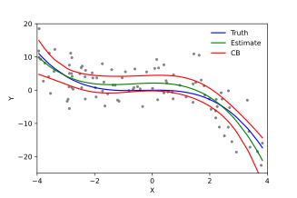

# Introduction {.unnumbered}

{width="502"}

Welcome to Modern Regression!

**Course Number:** 526 **Section Number:** 1

**Credit Hours:** 3 **Semester:** Fall 2026

**Class Hours and Location:** Monday & Wednesday 1:30-2:50pm at CNR 1051

**Instructor Name: Emily Peterson (Emily)** emily.nancy.peterson\@emory.edu

**Teaching Assistants:** Winn Wu [wencheng.wu\@emory.edu](mailto:winn.wu@emory.edu) Office hours: Tuesdays 10Am-12PM email to request remote session  <https://emory.zoom.us/j/3226912694>. . Location GCR 3rd floor library.

**Course Description:** This course introduces students to modern regression techniques commonly used in analyzing public health data. Specific topics include: (1) methods for modeling longitudinal and multi-level data that account for within group correlation (e.g., mixed-effect models, generalized estimating equations); (2) modeling non-linear relationships using splines and generalized additive models; and (3) shrinkage methods and bias-variance tradeoffs.

This course draws motivating examples from environmental and social epidemiology, health services research, clinical studies, etc. The course provides a survey of advanced regression approaches with a focus on data analysis and interpretation. Students will gain an understanding of methods that will facilitate future independent and collaborative research for modern research problems. Students will gain practical experiences using the R language for statistical computing.

This is a required course for MSPH students in BIOS in the fall of their second year. It is also an elective course for PhD BIOS students in their second year interested in advanced modeling techniques.

**Pre-reqs:** BIOS 509 and BIOS 513 or equivalent. Students are assumed to have background knowledge in linear algebra and multivariate calculus. Experience with R (BIOS 545).

**Using this book:** This book consists of the lectures notes used for this course in modern regression techniques. We will use this book to review concepts in class. The book is split into separate modules covering the particular topics in this course. In-class activities and homework assignments are outlined for each module.

::: {.callout-warning style="color: red" icon="false"}
I am frequently editing notes in this book. I do not suggest reading ahead in future modules as I may change material or assignments during the semester.
:::

------------------------------------------------------------------------

````{=html}
<!--
## Table of Contents

```{r, echo=FALSE, results='asis', message=FALSE, warning=FALSE}


# Auto-TOC for the whole book (Quarto book version)
if (!requireNamespace("yaml", quietly = TRUE)) install.packages("yaml")
library(yaml)

q <- yaml::yaml.load_file("_quarto.yml")
chapters <- q$book$chapters
if (is.null(chapters)) chapters <- q$book$parts

flatten_chaps <- function(x) {
  out <- c()
  for (item in x) {
    if (is.list(item) && !is.null(item$chapters)) {
      out <- c(out, item$chapters)
    } else {
      out <- c(out, item)
    }
  }
  out
}
chapters <- flatten_chaps(chapters)

read_title <- function(path) {
  if (!file.exists(path)) return(path)
  lines <- readLines(path, warn = FALSE)
  h1 <- grep("^#\\s+.+", lines, value = TRUE)
  if (length(h1)) {
    # Remove the leading "# " and also strip any trailing { ... } attributes
    title <- sub("^#\\s+", "", h1[1])
    title <- sub("\\s*\\{.*\\}\\s*$", "", title)
    return(title)
  } else {
    path
  }
}

cat("<ol>\n")
for (ch in chapters) {
  if (grepl("^index\\.(qmd|Rmd|md)$", ch)) next
  title <- read_title(ch)
  href <- sub("\\.(qmd|Rmd|md)$", ".html", ch)
  cat(sprintf("  <li><a href='%s'>%s</a></li>\n", href, title))
}
cat("</ol>\n")
```
-->
````
